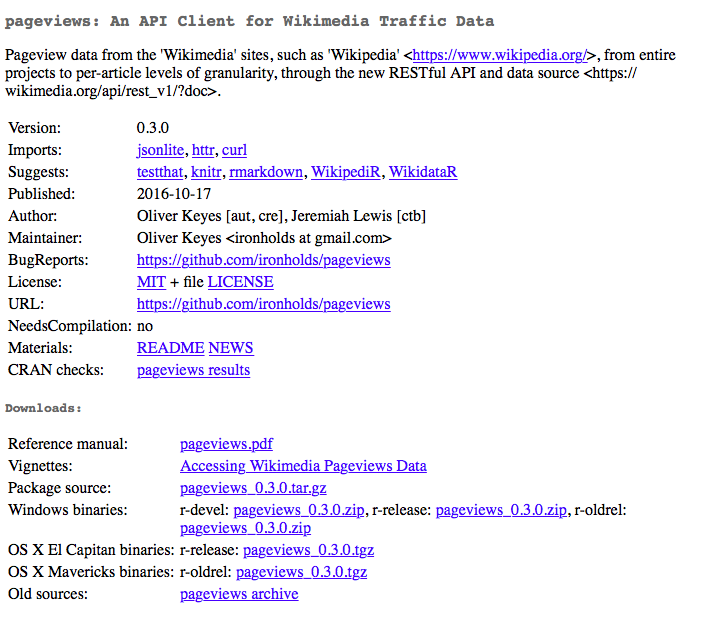
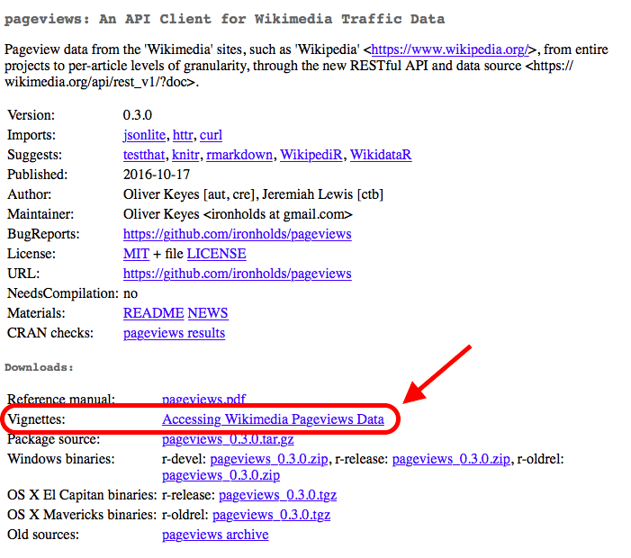
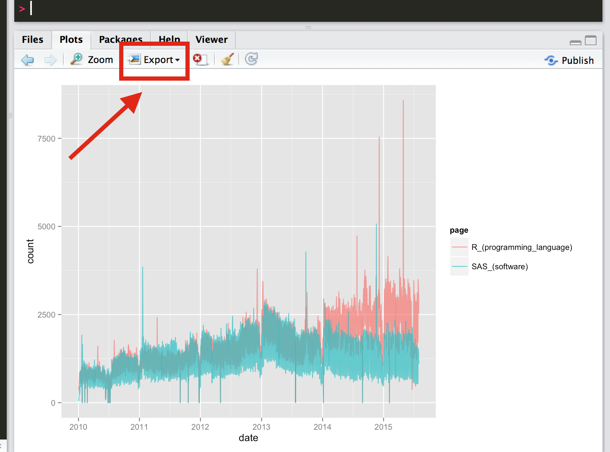

# Introduction

### Background

The first lab of the course will try show you some cool things `R` can do. Don't pay too much attention to the syntax of the commands we're using -- many are unique to the `mosaic` package we'll be installing in the next section. It is more important to think critically about the problems that are being solved and `R` is enabling us to perform tasks that would otherwise be impossible.

### Assignment Instructions

There are four sections in this document labeled "Your Turn". Each of these sections ask you to perform a task and enter some results in a Word document. Please put all responses in the same Word document and indicate which section each response corresponds to by including the section header -- e.g. *1) Your Turn -- Reflect on the Tests*. 

Please **convert the completed document to PDF** and upload to the *Lab 1/Homework Assignment* section on CourseConnect. Please name the file in the following manner: `week-1-homework-yourlastname.pdf`


****************************


# Lab

## Part 0 -- Installing Packages

First, we'll install some packages we'll be using later in the lab. Recall from the lecture that packages provide additional functionality not found in your base `R` installation. Run the code below in your RStudio console to install some packages we'll use in this lab.

```{r, eval=FALSE}
install.packages('mosaic') 
install.packages('mosaicData') 
install.packages('pageviews')
install.packages('ggplot2')
```


## Part 1 -- The Lady Tasting Tea


### Background

There is a famous (statistical) story about a lady who claimed that tea with milk tasted different depending on whether the milk was added to the tea or the tea added to the milk. The story is famous because of the setting in which she made this claim. She was attending a party in Cambridge, England, in the 1920s. Also in attendance were a number of university dons and their wives. The scientists in attendance scoffed at the woman and her claim. What, after all, could be the difference?

All the scientists but one, that is. Rather than simply dismiss the woman's claim, he proposed that they decide how one should *test* the claim. The tenor of the conversation changed at this suggestion, and the scientists began to discuss how the claim should be tested. Within a few minutes cups of tea with milk had been prepared and presented to the woman for tasting.

At this point, you may be wondering who the innovative scientist was and what the results of the experiment were.

The scientist was [R. A. Fisher](https://en.wikipedia.org/wiki/Ronald_Fisher), who first described this situation as a pedagogical example in his 1925 book on statistical methodology.

Fisher developed statistical methods that are among the most important and widely used methods to this day, and most of his applications were biological.

You might also be curious about how the experiment came out. How many cups of tea were prepared? How many did the woman correctly identify? What was the conclusion?

Fisher never says. In his book he is interested in the method, not the particular results. But we can use this setting to introduce some key ideas in statistics.

Let's suppose we decide to test the lady with ten cups of tea. We'll flip a coin to decide which way to prepare the cups. If we flip a head, we will pour the milk in first; if tails, we put the tea in first. Then we present the ten cups to the lady and have her state which ones she thinks were prepared each way. 

It is easy to give her a score (9 out of 10, or 7 out of 10, or whatever it happens to be). 

It is trickier to figure out what to do with her score. Even if she is just guessing and has no idea, she could get lucky and get quite a few correct -- maybe even all 10. But how likely is that?

Now let's suppose the lady gets 9 out of 10 correct. That's not perfect, but it is better than we would expect for someone who was just guessing. On the other hand, it is not impossible to get 9 out of 10 just by guessing. So here is Fisher's great idea: Let's figure out how hard it is to get 9 out of 10 by guessing. If it's not so hard to do, then perhaps that's just what happened, so we won't be too impressed with the lady's tea tasting ability. On the other hand, if it is really unusual to get 9 out of 10 correct by guessing, then we will have some evidence that she must be able to tell something.

### Testing the Lady's Luck

But how do we figure out how unusual it is to get 9 out of 10 just by guessing? We'll learn another method later, but for now, let's just flip a bunch of coins and keep track. If the lady is just guessing, she might as well be flipping a coin.

So here's the plan. We'll flip 10 coins. We'll call the heads correct  guesses and the tails incorrect guesses.  Then we'll flip 10 more coins, and 10 more, and 10 more, and ... That would get pretty tedious. Fortunately, computers are good at tedious things, so we'll let the computer do the flipping for us.

The `rflip()` function from the `mosaic` can flip one coin. Run the following code in your `R` console:

```{r, include = FALSE}
suppressMessages(library(mosaic))
```

```{r}
library(mosaic)
rflip()
```

or a number (10) of coins (keep running all these commands in `R`)

```{r}
rflip(10)
```

Typing `rflip(10)` a bunch of times is almost as tedious as flipping all those coins.  But it is not too hard to tell `R` to `do()` this a bunch of times.

```{r}
do(3) * rflip(10)
```

Let's get `R` to `do()` it for us 10,000 times and make a table of the results. You may have gotten answers that were slightly different from mine when you ran the above code. This is because `R` is using a [*random number generator*](https://en.wikipedia.org/wiki/Random_number_generation) to decide whether a coin is should be heads or tails. We will talk more about this later in the course, but for now we can make sure we get the same answers by running the following code to set our [random seed](https://en.wikipedia.org/wiki/Random_seed).

```{r}
set.seed(123)
```

The code below flips 10 coins 10,000 times and *assigns* the results to the variable `random.ladies` (review *assignment* from the lecture if needed).

```{r}
# store the results of 10000 simulated ladies
random.ladies <- do(10000) * rflip(10)
```

```{r, include = FALSE}
options( width=60 )
```

We can run the following code to count up the number of times & percentage of times we observed 1 heads, 2 heads, 3 heads, etc. 

```{r}
tally(~heads, data=random.ladies)
# We can also display table using percentages
tally(~heads, data=random.ladies, format="prop") 
```

We can display this table graphically using a plot called a `histogram` with bins of width~1. 


```{r}
histogram(~ heads, data=random.ladies, width=1) 
```

You might be surprised to see that the number of correct guesses is exactly 5 (half of the 10 tries) only `r round(as.numeric(tally(~heads, data=random.ladies, format="prop")[6]*100,2))`% of the time. But most of the results are quite close to 5 correct. For example, `r round(sum(table(random.ladies$heads)[5:7]/100,1))`% of the results are  4, 5, or 6, for example. About `r round(sum(table(random.ladies$heads)[4:8]/100,1))`% of the results  are between 3 and 7 (inclusive). But getting 8 correct is a bit unusual, and getting 9 or 10 correct is even  more unusual. 

So what do we conclude? It is possible that the lady could get 9 or 10 correct just by guessing, but it is not very likely (it only happened in about `r round( sum(table(random.ladies$heads)[10:11]/100), 1)`% of our simulations).  So *one of two things must be true*: 

- The lady got unusually "lucky", or  
- The lady is not just guessing. 

Although Fisher did not say how the experiment came out, others have reported that the lady correctly identified all 10 cups!


### 1) Your Turn -- Reflect on the Test

In this example we used a computer simulation to test a hypothesis. We aimed to compute the probability of the lady identifying a certain number cups correctly -- 9 in this case -- if she were simply guessing randomly. 

In your previous statistics courses you would have used *analytical* methods to compute similar probabilities (p-values). Here is a [link](https://onlinecourses.science.psu.edu/stat414/node/268) to a document that should contain some familiar formulas for testing for differences in proportions.

Write a paragraph on the differences between the two approaches and comment on whether either method makes more intuitive sense to you. 


***********


## Part 2 - Wikipedia Trends

### The `pageviews` Package

In the next activity we will be using the excellent [`pageviews`](https://cran.r-project.org/web/packages/pageviews/index.html) package to download data of Wikipedia page views. Clicking on [this link](https://cran.r-project.org/web/packages/pageviews/index.html
) will take us to the package's CRAN page. Clicking through, you should see a page that looks like the following:



Each package available on CRAN will have a CRAN web page associated with it. These pages are often useful sources of information about the package. Well documented packages will include concise descriptions of the package functionality, documentation of the methods provided by the package, and, often, a [vignette](http://r.789695.n4.nabble.com/what-is-a-vignette-td2302242.html) that includes worked examples showing a package's functionality. Fortunately, `pageviews` is a well documented package and we can learn plenty about what it does and how to use it. 

Please review the `pageviews` vignette by clicking on the highlighted link below. 



While the content and concepts may look a bit foreign to you now, it should be clear that we are able to perform some pretty impressive tasks with minimal effort. 


### Statistical Language Popularity on Wikipedia

Let's modify some of the code from the vignette to compare the popularity of (our favorite language) `R` and one of the historically most popular statistical programming languages, [`SAS`](https://en.wikipedia.org/wiki/SAS_(software)). Copy & paste the code below into your `R` console to create the figure in RStudio:

```{r, fig.width = 10, fig.height = 5, message = FALSE}
library(pageviews)
library(ggplot2)

page_views <- article_pageviews(
  project = "en.wikipedia", 
  article = c("R_(programming_language)", "SAS_(software)"),
  start = as.Date('2015-07-01'), 
  end = as.Date("2017-08-27"), 
  user_type = c("user"), 
  platform = "all"
  )

ggplot(page_views, aes(x=date, y=views, group=article, color=article)) + 
  geom_line(alpha = .7) +
  labs(x = "Date", y = "Page Views", title = "Historical Page Views for R & SAS")

```


### 2) Your Turn -- Exporting Graphics

You should now have a graph in your RStudio graphics pane displaying the daily page views (y-axis) for the `R` and `SAS` Wikipedia articles from 7/2015 until today. You can get graphics out of RStudio by using the export button highlighted below.



Export the image (and keep track of the file location). Import the graph you just exported into a Word document and write some sentences describing the graph. What language appears to be more popular. Does interest seem to fall or peak in any systematic manner?


### Tracking Presidential Candidate Popularity on Wikipedia

With little understanding of what is going on behind the scenes, we can modify the existing code to look at Wikipedia trends for anything of interest. As an example, let's take a look at page views for a few key players in the 2016 U.S. Presidential election (note the log axis).

There are a number of interesting things going on in this graph, including 3 main peaks in the page views for Donald Trump. The first appears in the time surrounding the "Super Tuesday" primaries where he began establishing himself as the likely nominee for the Republican party; the second corresponds to the time leading up to and immediately following the election; and the third occurs around the time of the inauguration. 


```{r, fig.width = 10, fig.height = 5, message = FALSE}
page_views <- article_pageviews(
  project = "en.wikipedia", 
  article = c('Donald_Trump', 'Hillary_Clinton', 'Bernie_Sanders', 'Ted_Cruz'),
  start = as.Date('2015-07-01'), 
  end = as.Date("2017-08-27"), 
  user_type = c("user"), 
  platform = "all"
  )

page_views$date <- as.Date(page_views$date)

ggplot(page_views, aes(x=date, y=views, group=article, color=article)) + 
  geom_line(alpha = .7) +
  labs(x = "Date", y = "Page Views", 
       title = "Historical Page Views for Presidential Candidates") + 
  scale_y_continuous(labels = scales::comma, trans = 'log10', 
                     breaks = c(1E3, 1E4, 1E5, 1E6)) + 
  scale_x_date(date_breaks = '1 month') + 
  theme_bw(14) + 
  theme(axis.text.x = element_text(angle = 45, hjust = 1)) 

```

### 3) Your Turn - Wikipedia Trends

Internet activity patterns can clue us in to all kinds of interesting events past and present. Try plotting the activity of some Wikipedia pages of interest. Include the graph(s) you make in a Word document. Also include a few sentences describing any trends you see in the graph and any interesting associations you can make between.

**Tips:**

You can make your own graphs by copying the code above and substituting your own page names in the third line of the code below.

```{r, eval = FALSE}
page_views <- article_pageviews(
  project = "en.wikipedia", 
  article = c('PUT', 'YOUR', 'TERMS', 'HERE'),
  start = as.Date('2015-07-01'), 
  end = as.Date("2017-08-27"), 
  user_type = c("user"), 
  platform = "all"
  )

ggplot(page_views, aes(x=date, y=views, group=article, color=article)) + 
  geom_line(alpha = .7) +
  labs(x = "Date", y = "Page Views", title = "YOUR GREAT GRAPH TITLE")

```

These search terms need to be valid Wikipedia page names. A Wikipedia page name is the string of text at the end of the page URL -- i.e. anything after `https://en.wikipedia.org/wiki/`. Below are some examples to illustrate the pattern. You will need to paste the text from the "Page Name" column into your `R` code. 

|Term            |URL                                           |Page Name       |
|:---------------|:---------------------------------------------|:---------------|
|Detroit Tigers  |https://en.wikipedia.org/wiki/Detroit_Tigers  |Detroit_Tigers  |
|Aquinas College |https://en.wikipedia.org/wiki/Aquinas_College |Aquinas_College |
|Justin Bieber   |https://en.wikipedia.org/wiki/Justin_Bieber   |Justin_Bieber   |


*******************


# Homework

## Learning More About Packages

`R` packages provide the ability for programmers and statisticians to extend the `R` language and easily share these enhancements with other `R` users across the globe. `R` packages empower you to do extremely complex tasks -- like, say, download and visualize the number of visitors to a given Wikipedia page -- in a small set of easy to use commands. Much of the popularity of the `R` language can be attributed to its ever-growing package system. 

In this section you'll read an article that will provide you with deeper understanding of what `R` packages are and what they are used for, where you can download them from the internet, and how to manage the packages you've installed once you've downloaded them from a package repository. 

### 4) Your Turn -- Reflect on the Reading

First, read [this DataCamp article on `R` packages](https://www.datacamp.com/community/tutorials/r-packages-guide#gs.PgHTxdA), then answer the following questions in your Word document

a. What is the `R` command used to uninstall a package?
b. What is the difference between the `library()` function and the `require()` function?
c. What is a library? How does a library relate to a package?


*******************


# References

Examples and text for part one were borrowed or adopted from the following resources:


<div xmlns:cc="http://creativecommons.org/ns#" xmlns:dct="http://purl.org/dc/terms/" about="http://www.mosaic-web.org/go/teachingRlicense.html"><span property="dct:title">Teaching Statistics Using R: An Instructors Guide</span> (<a rel="cc:attributionURL" property="cc:attributionName" href="http://www.mosaic-web.org/teachingR">Randall Pruim, Nicholas J. Horton and Daniel Kaplan</a>) / <a rel="license" href="http://creativecommons.org/licenses/by/3.0/">CC BY 3.0</a></div>


