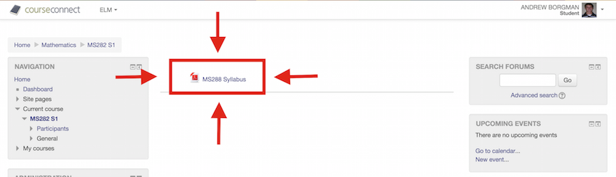
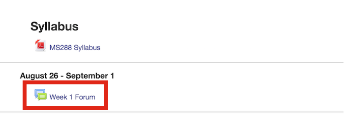
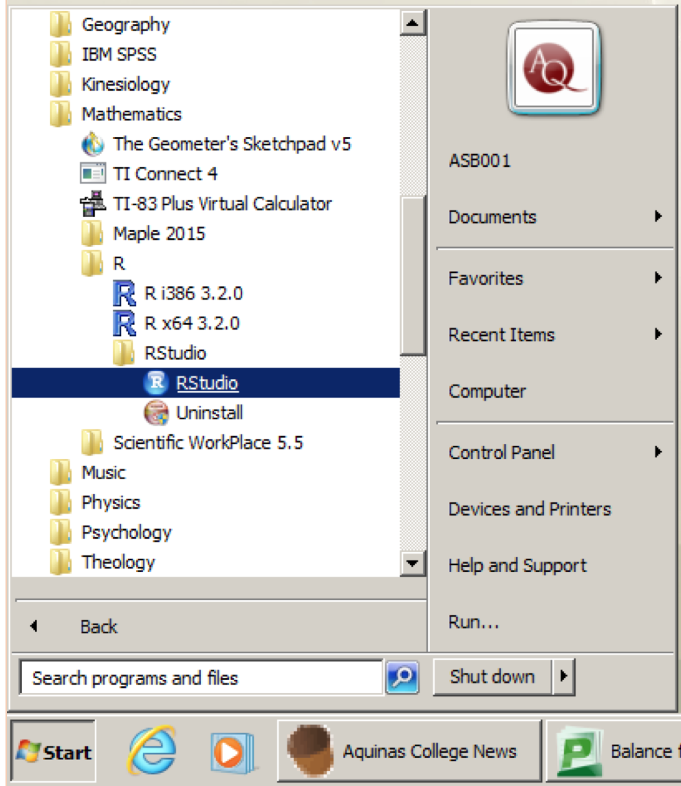
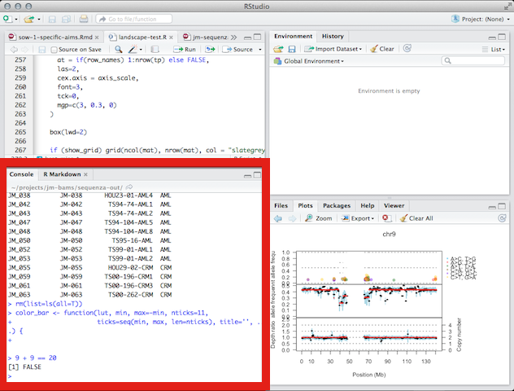

```{r config, echo=FALSE, message=FALSE, eval=TRUE, include = F}
library(knitr)
# opts_chunk$set(results="hide", message=FALSE, fig.show="hide", fig.align="center", tidy=TRUE)
opts_chunk$set(message=FALSE, fig.align="center", tidy=TRUE)
```


# Introductions

## About Me

- Aquinas Grad (2011)
- MS Biostatistics @ GVSU
- Currently working @ Spectrum Health
- Programming in `R` for 6 years
- Email: asb001@aquinas.edu

## About You

- Name
- Year & Major
- Reason for taking MS282
- Prior programming experience
- Something fun you did this summer


# Class Logistics

## Overview

- [All course content on CourseConnect](https://courses.aquinas.edu/course/view.php?id=1552)
    + Enrollment key: `bayes`
- Class periods will be 1/2 lecture, 1/2 lab
    + Lectures will be interactive
    + Labs done in partners or groups
- Homework or quizzes assigned most weeks


## Grade Breakdown

- Homework or quizzes (25%)
- One group project (25%)
    + Projects and groups to be assigned before Fall Break
- Midterm and final (50%)


## Syllabus

- [Available on CourseConnect](https://courses.aquinas.edu/mod/resource/view.php?id=97211)



*note: class schedule is subject to change*

## Presumed Prerequisites

- No programming knowledge presumed
    + Interest in programming required
- Some stats knowledge presumed
    + Conceptual refreshers will be given for statistical techniques


## Getting Help

- Weekly *forums* will be available on CourseConnect
- Please post general questions about course here
- Students can feel free to answer questions if they ran into same issue and solved it
    - Extra credit will be given for answering classmates questions
- Personal questions can be sent to me (asb001@aquinas.edu)
    + But I may ask if I can post to forum if I think there is benefit




# What is R?


## Let's have a look @ a *twotorial*

<iframe src="https://player.vimeo.com/video/52999628" width="500" height="281" frameborder="0" webkitallowfullscreen mozallowfullscreen allowfullscreen></iframe> <p><a href="https://vimeo.com/52999628">what is R? the lingua statistica, s&#039;il vous pla&icirc;t</a> from <a href="https://vimeo.com/ajdamico">Anthony Damico</a> on <a href="https://vimeo.com">Vimeo</a>.</p>

## What is `R`?

- A fully functional programming language!
- Originally developed @ Bell Labs for *interactive* data analysis
    - Was called `S` back then (~1976)
- Open sourced in 1993 under the name `R`
    - Designed to be "not unlike `S`"
- Strong emphasis on statistics
- Excellent for data visualization
- Gaining popularity in many circles 

## Where is it being used?

- Marketing Analytics
    + [#4 fastest growing job](http://www.careerinfonet.org/oview1.asp?next=oview1&Level=edu3&optstatus=&jobfam=&id=1&nodeid=3&soccode=&stfips=00&ShowAll=)
- Science/Engineering
- Finance
- IT


# Introducing RStudio


## What is RStudio?

- A free piece of software to make working with `R` easier
- An integrated development environment (IDE) for the `R` language
- Available for Windows, Mac, Linux
    + You get the same interface regardless of platform
- Open source - just like `R`


## Accessing RStudio

- Can access on AQ computers (demo)
    + Available from academic software collection
- Strongly suggest installing on your personal computer
- Need to install `R` first ([Windows](https://cran.r-project.org/bin/windows/base/); [Mac](https://cran.r-project.org/bin/macosx/))
- RStudio downloads for all platforms [here](https://www.rstudio.com/products/rstudio/download/)


## A Brief Tour of RStudio

**(demo time)**




# Interactive Computing in R

## The `R` Console

- Basic interaction with R is by typing in the **console**, a.k.a. **terminal** or **command-line**
- You type in commands, R gives back answers (*or errors*)
- This is how we will use `R` for the first part of the course


## The `R` Console | [Here's some useful tips](https://support.rstudio.com/hc/en-us/articles/200404846-Working-in-the-Console) on using the *R* console in *RStudio*.




## `R` Calculator

* The `R` console can be used as a calculator
* Enter the following commands into your `R` console to see it in action:

```{r}
2+2
5*4
2^3
```

## `R` Calculator

* It is also smart enough to understand order of operations:

```{r}
2+3*4/(5+3)*15/2^2+3*4^2
```
<div class="red2">
But `R` can be much more than just a calculator... :)
</div>


## Assignment

* Values in `R` are assigned to **variables**
    - "`<-`" is known as the *assignment operator*
    - The *assignment operator* assigns values to variables
* Variables allow us to name *things* we're using in our `R` computations 
    - Let's them be easily accessed and manipulated later
* Here's an example of assigning the number `3` to the variable name `x`:

```{r}
x <- 3
```


## Assignment

* When you type the name of a variable that has been assigned a value, `R` will print the assigned value

```{r}
x <- 3
x
```

## Assignment

- A few variables are built in:

```{r}
pi
letters
month.name
```

## Assignment

<div class="red2">
You will get an error if you type the name of an variable that does not have an assigned object: 
</div>

<br/>


```{r, eval=FALSE}
y
```

```
## [1] Error: object 'y' not found
```


## Assignment

The assignment operator also changes values:

```{r}
x <- 10
x
x <- 'hello'
x
```

## Assignment - Why?

Using names and variables makes code: easier to design, easier to debug, less prone to bugs, easier to improve, and easier for others to read

Named variables are a first step towards **abstraction**

## A Note on Scripting

- For the first few classes, all our work in `R` will be interactive
    + All work will be done typing things into console
- *Scripting* involves storing sets of `R` commands in text files
- Scripts allow the same set of code to be executed without needed to manually type anything 


# The R Community


## `R` Community

- `R` has a very large and very active user base
- This is an invaluable help resource for new (and experienced) users
    + Mailing lists, Q/A forums, tutorials/courses, etc
- This group is constantly extending the language
    + Extra functionality available through `R` **packages**


## Finding Help Online

- Comprehensive overview of *all* of `R` is not possible 
- Learning to find solutions online is critical
- **Goal:** Once you have some familiarity with `R`, you'll be able to *"Google your way out"* of most problems you run into.


## Good Places to Look for Help

- [StackOverflow](http://stackoverflow.com/questions/tagged/r) for programming help
- [CrossValidated](http://stats.stackexchange.com/) for statistics help
- [R mailing list](https://www.r-project.org/search.html) for more programming help


## `R` Packages

- User contributed **packages** make `R` truly special
- A **package** is just a set of `R` scripts that extend the language
    + e.g. allow for the calculation of new statistical method or easy creation of graphic
- Publicly available packages are stored in a remote **repository**
    + Comprehensive R Archive Network (CRAN) is the most popular
- Packages can be installed to local **libraries** to be used in interactive sessions


## `R` Packages

R packages are installed with:

`install.packages("packagename")`

where *packagename* is the name of the package you would like to install. Packages are installed into a **library** on the local machine.

Here we install the `reshape2` package -- a package for making common data manipulation easier:

```{r, eval=FALSE}
install.packages('reshape2')
```

## `R` Packages

Once a package has been installed to a local library, its functionality can be **loaded** into `R` by using the `library` function:

```{r, eval = FALSE}
library(reshape2)
```

...`reshape2` functionality is now available at the `R` console


## External Resources

- [RStudio provides many online learning resources](http://www.rstudio.com/resources/training/online-learning/)
- [And even more helpful links buried in an RStudio wiki page](https://support.rstudio.com/hc/en-us/articles/200552336-Getting-Help-with-R)
- [Code School has an excellent tutorial to help you get acquainted with R](http://tryr.codeschool.com/) 
- [StackOverflow is a great place to find answers to R programming questions](http://stackoverflow.com/questions/tagged/r)
- [Google Developers intro to R video tutorials](https://www.youtube.com/watch?v=iffR3fWv4xw&list=PLOU2XLYxmsIK9qQfztXeybpHvru-TrqAP)
- [Twotorials provide 2 minute videos for doing all kinds of things in R](http://www.twotorials.com/)

# Lab Time!


