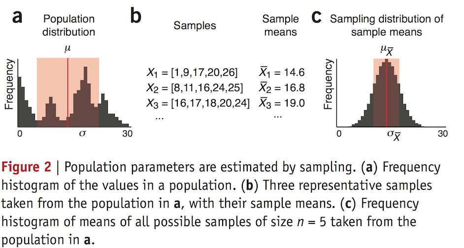
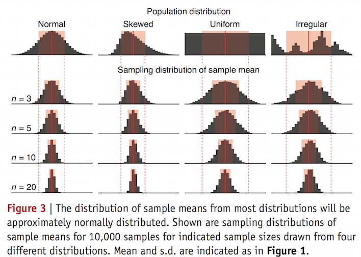
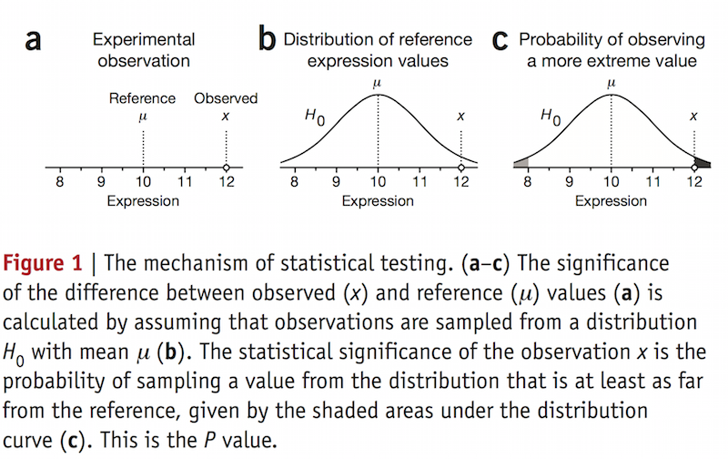
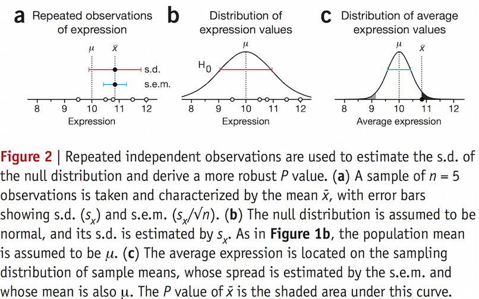
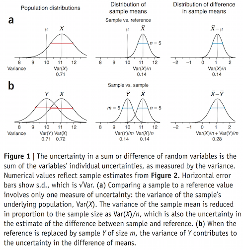
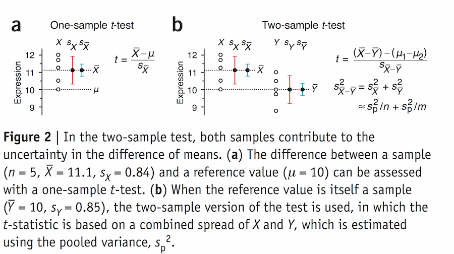
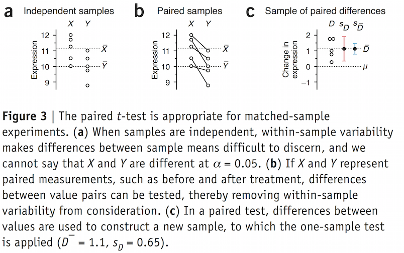
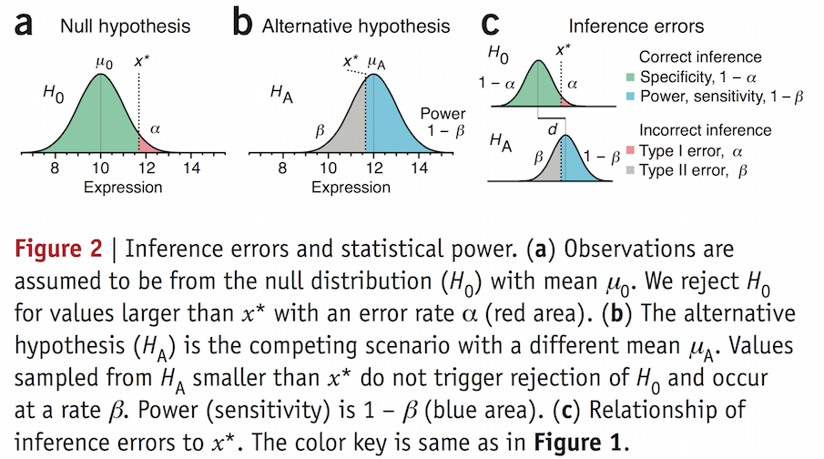
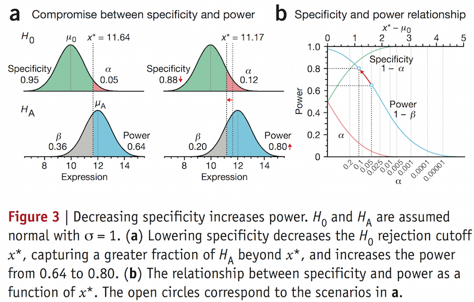

# Week 11: Hypothesis Testing
MS 282  
`r format(Sys.time(), '%B %d, %Y')`  


## notes

- have the kids read this: http://www.nicebread.de/whats-the-probability-that-a-significant-p-value-indicates-a-true-effect/
- and potentially this: http://rsos.royalsocietypublishing.org/content/royopensci/1/3/140216.full.pdf
- THE MAIN FOCUS OF THIS SHOULD PROBABLY BE P-VALUES AND INTEPRETING P-VALUES

A separate presenter window can also be opened (ideal for when you are presenting on one screen but have another screen that’s private to you). The window stays in sync with the main presentation window and also shows presenter notes and a thumbnail of the next slide. To enable presenter mode add ?presentme=true to the URL of the presentation, for example:


# Questions


## From The Syllabus

(a) One- & two-sample *t*-test and underlying assumptions
(b) Non-parametric alternatives when assumptions are violated 
(c) The paired *t*-test & matched pairs Wilcoxon test

## Overview

- an introduction to hypothesis testing
- introducing the *t*-test
- checking assumptions for the *t*-test
	+ checking normality graphically & via statistical tests
	+ skewness and kurtosis


# Background & Review From Last Class


## Some Terms We Definitely Need to Know

- Test statistic
- Effect size
- p-value
- power
- sample size


## The Sampling Distribution



<font size="2">[Source](http://www.nature.com/nmeth/journal/v10/n9/full/nmeth.2613.html)</font>


## The Sampling Distribution -- CLT & Sample Size



<font size="2">[Source](http://www.nature.com/nmeth/journal/v10/n9/full/nmeth.2613.html)</font>


## The Sampling Distribution -- Sample Size


<font size="2">[Source](http://www.nature.com/nmeth/journal/v10/n9/full/nmeth.2613.html)</font>


## Relation of Confidence Intervals + Sample Size


<font size="2">[Source](http://www.nature.com/nmeth/journal/v12/n3/abs/nmeth.3288.html)</font>


# An Introduction to Hypothesis Testing

## The 5-step Outline

The following 5-step outline is a useful way to organize the ideas of hypothesis testing:

1. State the Null and Alternative Hypotheses
2. Check test assumptions
3. Compute the Test Statistic
4. Determine the p-value
5. Draw a conclusion

## One vs. Two Sided Hypothesis Tests

Later, we'll be learning how to compare means of two groups. Our null hypothesis is that they are equal:

$$ 
	H_{0}: \mu_{1} = \mu_{2}
$$

Alternatively, we may have a research “hunch” that one is larger than the other, resulting in a one-tailed alternative:

$$
	H_{a}: \mu_{1} > \mu_{2} \quad or \quad H_{a}: \mu_{1} < \mu_{2}
$$

If the research hypothesis is not clearly in one direction only, we conduct a two-tailed test:

$$
	H_{a}: \mu_{1} \neq \mu_{2}
$$

## One vs. Two Sided Hypothesis Tests

The advantage of a one-tailed test is that sometimes it is intuitive to only look in one direction. Also, this makes it easier to reject $H_{0}$.

Two-tailed tests have several advantages:

- They are viewed as more statistically “ethical”, and conservative, because we are considering both directions and are making it more difficult to reject $H_{0}$
- Two-tailed tests are more robust to violations of assumptions than one-tailed tests.
- In the event of a significant result, we are still allowed to make our conclusion with the specific direction


## Graphical Depiction of Hypothesis Testing



<font size="2">[Source](http://www.nature.com/nmeth/journal/v10/n11/full/nmeth.2698.html)</font>


## Our first hypothesis test: the *t*-test

- A test used for comparing means
- Valid for one and two samples
	+ Two sample case is much more common in practice
- When assumptions are met, the two-sample *t*-test is the **optimal** procedure for comparing means

## Assumptions of The *t*-test

- data are quantitative (preferably continuous)
- samples are drawn from populations that are normal in shape 
	+ test is robust to deviations from normality 
- sample populations are required to have the same variance 
	+ test is robust to this as well
	+ methods have been developed to get around this (Welch's)
- samples are uncorrelated
	+ correlation between samples can arise when data are obtained from matched samples or repeated measurements


## The One Sample *t*-test



<font size="2">[Source](http://www.nature.com/nmeth/journal/v10/n11/full/nmeth.2698.html)</font>

## One Sample *t*-test Test Statistic

Recall our standard error of the mean formula:

$$
	SEM = \frac{\sigma}{\sqrt{n}}
$$

Our test statistic, $t$, is of the form 

$$
	t = \frac{estimate − hypothesis\ value}{standard error}
$$

Since we don't know our population standard deviation, $\sigma$, we use our estimate from the sampled data ($s$). 


## One Sample *t*-test Test Statistic

Our null hypothesis states we believe the true mean of the population we are sampling from, $\mu$, is equal to some value, $\mu_{0}$

$$ 
	H_{0}: \mu = \mu_{0}
$$

Our test statistic then becomes:

$$
	t = \frac{\bar{x} − \mu_{0}}{\frac{s}{\sqrt{n}}}
$$

This statistic has been shown to follow a *t*-distribution with $n - 1$ degrees of freedom. Our confidence intervals take the form:

$$
	\bar{x} \pm t_{*} SE
$$


## One Sample Test in `R`

These are not frequently used in practice. They test whether the mean of the sample differs from a reference value. 


```r
exprs <- rnorm(n = 5, mean = 11.1, sd = 0.84)
t.test(exprs, mu = 10)
```

```
## 
## 	One Sample t-test
## 
## data:  exprs
## t = 1.6251, df = 4, p-value = 0.1795
## alternative hypothesis: true mean is not equal to 10
## 95 percent confidence interval:
##   9.459006 12.068207
## sample estimates:
## mean of x 
##  10.76361
```

## Combining Variances



<font size="2">[Source](http://www.nature.com/nmeth/journal/v11/n3/full/nmeth.2858.html)</font>
	

## One and Two Sample *t*-tests



<font size="2">[Source](http://www.nature.com/nmeth/journal/v11/n3/full/nmeth.2858.html)</font>


## Two Sample *t*-test in `R` {.smaller}

Two sample Student's *t*-test:

$$
	H_{M} = H_{F} \\
	H_{a} \neq 10
$$


```r
sex <- c(rep('M', 5), rep('F', 5))
weight <- c(140, 180, 188, 210, 190, 120, 190, 129, 120, 130)
t.test(weight~sex, var.equal = TRUE)
```

```
## 
## 	Two Sample t-test
## 
## data:  weight by sex
## t = -2.4982, df = 8, p-value = 0.03705
## alternative hypothesis: true difference in means is not equal to 0
## 95 percent confidence interval:
##  -84.23077  -3.36923
## sample estimates:
## mean in group F mean in group M 
##           137.8           181.6
```

## Welch's *t*-test

Welch's *t*-test relaxes the equal variances assumption by not using a pooled variance estimator and does not have any substantial disadvantages to Student's t-test. **It is the default test in `R` and I would suggest you to use it in almost all situations.**

$$
	t \quad = \quad {\; \overline{X}_1 - \overline{X}_2 \; \over \sqrt{ \; {s_1^2 \over N_1} \; + \; {s_2^2 \over N_2} \quad }}
$$


```r
# welch's is default test in R
t.test(weight~sex)
```

```
## 
## 	Welch Two Sample t-test
## 
## data:  weight by sex
## t = -2.4982, df = 7.8515, p-value = 0.03758
## alternative hypothesis: true difference in means is not equal to 0
## 95 percent confidence interval:
##  -84.36429  -3.23571
## sample estimates:
## mean in group F mean in group M 
##           137.8           181.6
```

## Paired *t*-tests

- Real world data sets are often correlated
	+ This violates the assumption of the traditional *t*-test
- Examples include:
	+ Measurements on patients before and after treatment
	+ Student's test scores before and after some training
- Taking this correlation into account is crucial for proper inference
- The paired t-test is one approach to dealing with this correlation


## Paired *t*-tests



<font size="2">[Source](http://www.nature.com/nmeth/journal/v11/n3/full/nmeth.2858.html)</font>

## Paired *t*-test Motivating Example

Trace metals in drinking water affect the flavor and an unusually high concentration can pose a health hazard. Ten pairs of data were taken measuring zinc concentration in bottom water and surface water. Does the data suggest that the true average concentration in the bottom water exceeds that of surface water?

Click [here](https://courses.aquinas.edu/mod/resource/view.php?id=102567) to download the zinc data set from CourseConnect.


```r
zinc <- read.delim('data/zinc_data.txt')
```

<font size="2">[Data Source](https://onlinecourses.science.psu.edu/stat500/node/51)</font>

## Step 1: State our Hypothesis

A paired *t*-test is just a one-sample *t*-test on the difference ($D$) of the paired observations and $\mu_{0} = 0$. We would state our null and alternative hypotheses as follows:

$$ 
	H_{0}: D = 0 \\
	H_{a}: D \neq 0
$$

## Step 2: Check our Assumptions

Our sample must be from an approximately normal distribution. Our sample size is small, so normality is difficult to assess with a histogram. A reasonably linear QQ-plot gives us confidence this assumption is met. 


```r
d <- zinc[['bottom']] - zinc[['surface']]

par(mfrow = c(1, 2))
hist(d)
qqnorm(d)
qqline(d)
```

 

```r
par(mfrow = c(1, 1))
```

## Steps 3 & 4: Test Statistic & P-Value

Steps 3 and 4 are accomplished simultaneously by running `t.test` in `R`.


```r
t.test(d, mu = 0)
```

```
## 
## 	One Sample t-test
## 
## data:  d
## t = 4.8638, df = 9, p-value = 0.0008911
## alternative hypothesis: true mean is not equal to 0
## 95 percent confidence interval:
##  0.043006 0.117794
## sample estimates:
## mean of x 
##    0.0804
```


## Steps 3 & 4: Test Statistic & P-Value

We can store the t-test object and extract information from it:


```r
result <- t.test(d, mu = 0)
result$statistic
```

```
##        t 
## 4.863813
```

```r
result$p.value
```

```
## [1] 0.0008911155
```

```r
result$estimate
```

```
## mean of x 
##    0.0804
```

```r
result$conf.int
```

```
## [1] 0.043006 0.117794
## attr(,"conf.level")
## [1] 0.95
```

## Steps 3 & 4: Alternative Approach

`t.test` has a paired option which will allow us to pass it two paired vectors and it will compute the difference for us:


```r
t.test(x = zinc[['bottom']], y = zinc[['surface']], paired = TRUE)
```

```
## 
## 	Paired t-test
## 
## data:  zinc[["bottom"]] and zinc[["surface"]]
## t = 4.8638, df = 9, p-value = 0.0008911
## alternative hypothesis: true difference in means is not equal to 0
## 95 percent confidence interval:
##  0.043006 0.117794
## sample estimates:
## mean of the differences 
##                  0.0804
```

## Step 5: Draw a conclusion

There is sufficient statistical evidence (p = 0.0008) to conclude that, on average, bottom water zinc concentration is higher than surface water zinc concentration. Furthermore, we are 95% confident that bottom water, on average, had a concentration of 0.043 to 0.117 units of zinc higher than surface water. 

> State the conclusion of your test. If significant, include a confidence interval for interpretation. 

## Effect of Pairing

What happens if we do not use a paired *t*-test:


```r
t.test(x = zinc[['bottom']], y = zinc[['surface']], var.equal = TRUE)
```

```
## 
## 	Two Sample t-test
## 
## data:  zinc[["bottom"]] and zinc[["surface"]]
## t = 1.2913, df = 18, p-value = 0.2129
## alternative hypothesis: true difference in means is not equal to 0
## 95 percent confidence interval:
##  -0.05040823  0.21120823
## sample estimates:
## mean of x mean of y 
##    0.5649    0.4845
```

# Errors, Power, and Sample Size

## Errors in Hypothesis Testing


<font size="2">[Source](http://www.csic.cornell.edu/Elrod/*t*-test/index.html)</font>

## Errors in Hypothesis Testing



<font size="2">[Source](http://www.nature.com/nmeth/journal/v10/n12/pdf/nmeth.2738.pdf)</font>

<div class="notes">
A test should ideally be both specific (low false positive rate, a) and sensitive (low false negative rate, b). The a and b rates are inversely related: decreasing a increases b and reduces power
</div>

## Inverse Relationship Between $\beta$ and $\alpha$



<font size="2">[Source](http://www.nature.com/nmeth/journal/v10/n12/pdf/nmeth.2738.pdf)</font>

<div class="notes">
We can increase power by decreasing specificity. Increasing a to 0.12 lowers the cutoff to x > 11.17, and power is now 0.80. This 25% increase in power has come at a cost: we are now more than twice as likely to make a false positive claim (a = 0.12 vs. 0.05). 
</div>

## Sample Size, Effect Size, & Power


<font size="2">[Source](http://www.nature.com/nmeth/journal/v10/n12/pdf/nmeth.2738.pdf)</font>	&nbsp;&nbsp;&nbsp; $d = (\mu_{A} – \mu_{0}) / s$


## Sample Size & Assumptions

1. When the population is normal, we can use these methods for any sample size.
2. When the population is very nearly normal (unimodal and at most modestly skewed), we can use these methods even for fairly small sample sizes.
3. For most population distributions that occur in practice, sample sizes of n ≥ 30 work quite well.
4. Because outliers can substantially affect both the mean $\bar{x}$ and the standard deviation $s$, outliers should be investigated. If it is unclear why an unusual observation is in the data, it may not be clear whether it should be removed or not, and the conclusions may differ substantially with and without the outlier.

## Some Parting Thoughts on Hypothesis Testing

- It's all about context
- Focus more on effect size than p-values
- Visualize your data!


