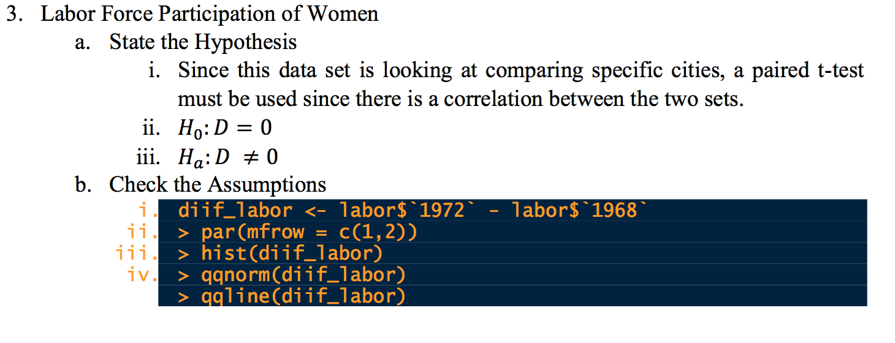
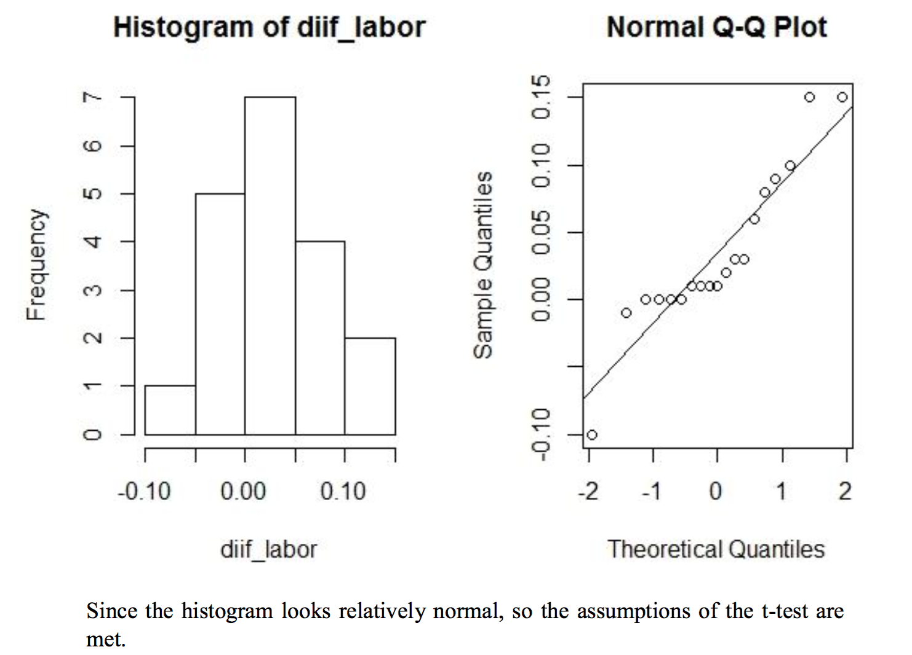
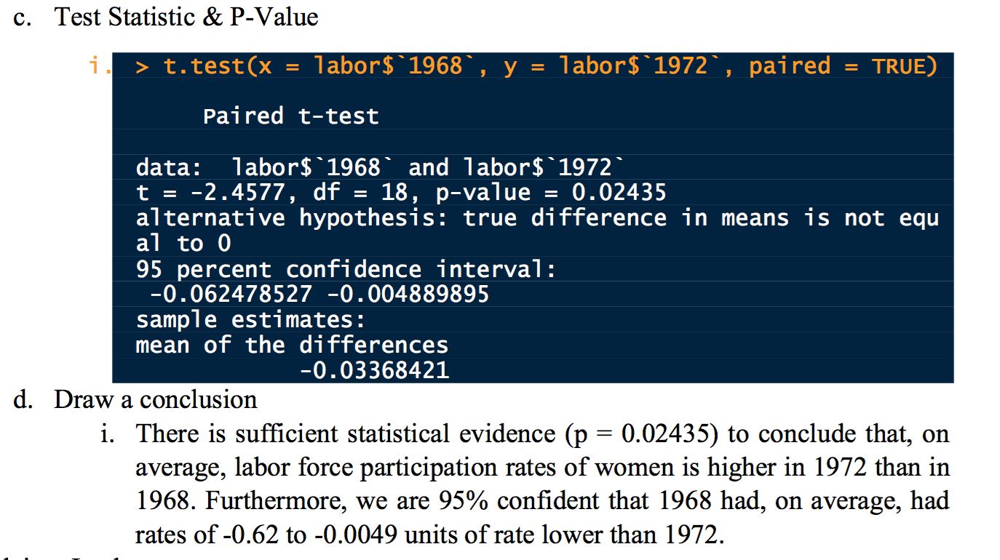

```{r config, include=FALSE}
knitr::opts_chunk$set(warning = FALSE, fig.align = 'center', 
                      verbose = TRUE, message = FALSE)
```

# Lab: The Maths


## Learning the Math Behind the ANOVA

We gave a high level overview of the mathematical ideas behind the ANOVA in class. Your lab will have you watch a few videos to expose you to the actual mathematical calculations underpinning this method. Please watch the three videos linked below. You will not be tested on the mathematics but it is useful to know how these values are derived and their relation to the F-statistic used to compute p-values for ANOVA tests.

- [Video 1: Calculating SST](https://www.khanacademy.org/math/probability/statistics-inferential/anova/v/anova-1-calculating-sst-total-sum-of-squares)
- [Video 2: Calculating SSW and SSB](https://www.khanacademy.org/math/probability/statistics-inferential/anova/v/anova-2-calculating-ssw-and-ssb-total-sum-of-squares-within-and-between-avi)
- [Video 3: The ANOVA Hypothesis Test](https://www.khanacademy.org/math/probability/statistics-inferential/anova/v/anova-3-hypothesis-test-with-f-statistic)


# Homework: Analyzing Some Variance

## Directions

You will perform an analysis of variance for each question below. Please follow the hypothesis testing steps discussed in Week 11 (and shown in the next section). 

You will need to determine the appropriate test for each data set after checking assumptions. Please acknowledge which analysis of variance procedure you are using (ANOVA or Kruskal Wallis) and why you chose to use it. If the overall analysis of variance test is significant, please perform a multiple comparisons analysis and interpret the results. 


## Example Hypothesis Test

The image below shows a former student's submissions for last week's homework assignment. This individual did an excellent job following the directions specified to perform a hypothesis test. Please use this as a model of how to write up your hypothesis tests for this assignment. 






## 1) Cancer Survival

Data set can be downloaded from [here](https://courses.aquinas.edu/mod/resource/view.php?id=102940) on CourseConnect.

This dataset contains survival time (in days) for patients with advanced cancers of the stomach, bronchus, colon, ovary or breast that were treated with ascorbate. The purpose of the study was to determine if patient survival differed with respect to the organ affected by the cancer.

**The original authors took the square root of the survival time to transform the data prior to performing their analysis.** Feel free to do the same or to proceed with an alternative approach. 

Description of Variables:

```
Survival: Survival time in days
Organ: Organ affected by the cancer
```

**Reference:** Cameron, E. and Pauling, L. (1978) Supplemental ascorbate in the supportive treatment of cancer: re-evaluation of prolongation of survival times in terminal human cancer. *Proceedings of the National Academy of Science USA*, 75, 4538Ð4542.


## 2) Word List Equivalence 

Data set can be downloaded from [here](https://courses.aquinas.edu/mod/resource/view.php?id=102941) on CourseConnect.

Hearing aids must be fit individually. A common way to test whether a particular hearing aid is right for a patient is to play a tape on which 25 words are pronounced clearly but at low volume, and ask the patient to repeat the words as heard. Different lists are available that are supposed to be of equal difficulty to understand correctly. This study was designed to assess whether the lists are equally difficult to understand.

In this experiment, 24 subjects with normal hearing listened to standard audiology tapes of English words at low volume, with a noisy background. They repeated the words and were scored correct or incorrect in their perception of the words. The order of list presentation was randomized.

The original authors used a technique we have not covered (two-way ANOVA) to account for variance introduced by subjects. I want you to ignore subject and perform an analysis of variance to see if hearing scores are different for the 4 word lists. 


Description of Variables:

```
SubjectID: Code for each subject - 24 of them
ListID: Code for each list played
Hearing: Score received on hearing test
```

**Reference:** Loven, Faith. (1981). *A Study of the Interlist Equivalency of the CID W-22 Word List Presented in Quiet and in Noise.* Unpublished MS Thesis, University of Iowa.


## 3) Wasting Cloth

Data set can be downloaded from [here](https://courses.aquinas.edu/mod/resource/view.php?id=102943) on CourseConnect.

The data refer to five suppliers of the Levi-Strauss clothing manufacturing plant in Albuquerque. The firm's quality control department collects weekly data on percent-age waste (run-up) relative to what can be achieved by computer layouts of patterns on cloth. It is possible to have negative values, which indicate that the plant employees beat the computer in controlling waste. Under question are differences among the five supplier plants.

Description of Variables:

```
Plant: Supplier
Run_Up: Percent-age waste (run-up)
```

**Reference:** L. Koopmans, *Introduction to Contemporary Statistical Methods*, Duxbury Press, 1987, p 86.


## Data References

These data sets were taken from [The Data and Story Library](http://lib.stat.cmu.edu/DASL/). 


