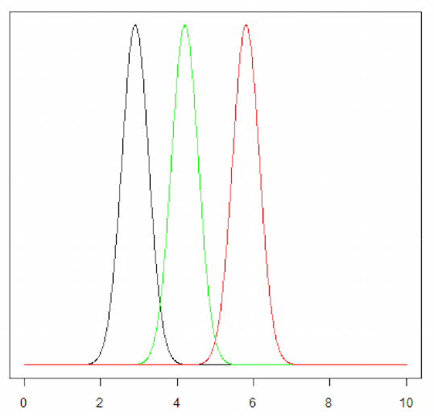
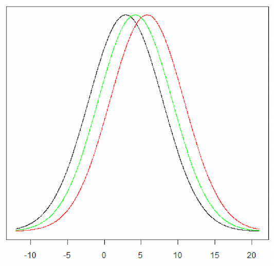

```{r, include = FALSE}
set.seed(030289)
```

# Questions

## Overview

- recap
- ANOVA
- Kruskal-Wallis


## Comparing Means Last Class

- Discussed the 1 & 2 sample *t*-tests
- Two independent samples t-test for 2 groups
- What do we do if we have more than 2 groups?
- Do we just keep doing t-tests?


## Comparing Means Last Class

- Discussed the 1 & 2 sample *t*-tests
- Two independent samples t-test for 2 groups
- What do we do if we have more than 2 groups?
- Do we just keep doing t-tests?

**...no!**


## Recap of Type I Errors

In hypothesis testing we must take enough precaution to see that the differences are not just through random chance.

At the heart of Type I error is the idea that we don't want to make an incorrect decision, so we exercise a lot of care by minimizing the chance of its occurrence.

Traditionally we try to set Type I error as .05 or .01 - as in there is only a 5 or 1 in 100 chance that the variation that we are seeing is due to chance. This is called the 'level of significance'.

<font size="2">[Source](http://www.stat.berkeley.edu/~hhuang/STAT141/Lecture-FDR.pdf)</font>


## Multiple *t*-tests & Type I Errors

So, Type 1 Error = probability of rejecting $H_{0}$ even though it is true.


## Multiple *t*-tests & Type I Errors

So, Type 1 Error = probability of rejecting $H_{0}$ even though it is true

This probability is for 1 hypothesis test. What happens if we have multiple tests?


## Multiple *t*-tests & Type I Errors

So, Type 1 Error = probability of rejecting $H_{0}$ even though it is true

This probability is for 1 hypothesis test. What happens if we have multiple tests?

Suppose we wanted to compare the means for three populations.  We could do three individual two-sample *t*-tests:

- Population 1 vs. Population 2
- Population 1 vs. Population 3
- Population 2 vs. Population 3


## Multiple *t*-tests & Type I Errors

So, Type 1 Error = probability of rejecting $H_{0}$ even though it is true

This probability is for 1 hypothesis test. What happens if we have multiple tests?

Suppose we wanted to compare the means for three populations.  We could do three individual two-sample *t*-tests:

- Population 1 vs. Population 2
- Population 1 vs. Population 3
- Population 2 vs. Population 3

**We now have not one hypothesis test but three.**


## Multiple *t*-tests & Type I Errors

Say we test the null hypothesis for each of our three pairs at the 5% significance level, we have a 5% probability of a Type I error for each test. Now what is the probability of a Type I error for **at least one** of the three tests? Answer:

Probability of Type I error for at least one of the 3 tests 

```
	= 1 – (Prob. of Type I error for NONE of the 3 tests) 
	= 1 – (No Type I error for the 1st, 2nd and 3rd test) 
	= 1 – (0.95)(0.95)(0.95)  b/c events are independent  
	= roughly 14 % 
```


## Multiple *t*-tests & Type I Errors {.smaller}

What if we have 4 groups?

With 4 populations you have six pairs:

- Population 1 vs. Population 2
- Population 1 vs. Population 3
- Population 1 vs. Population 4
- Population 2 vs. Population 3
- Population 2 vs. Population 4
- Population 3 vs. Population 4 

Hence the probability of Type I error for at least one of the 6 tests 

```
	= 1 – (Prob. of Type I error for NONE of the 6 tests)
	= 1 – (No Type I error for the 6 tests)
	= 1 – (0.95)(0.95)(0.95)(0.95)(0.95)(0.95)
	= roughly 26 %
```

## Multiple *t*-tests & Type I Errors {.smaller}

What if we have 4 groups?

With 4 populations you have six pairs:

- Population 1 vs. Population 2
- Population 1 vs. Population 3
- Population 1 vs. Population 4
- Population 2 vs. Population 3
- Population 2 vs. Population 4
- Population 3 vs. Population 4 

Hence the probability of Type I error for at least one of the 6 tests 

```
	= 1 – (Prob. of Type I error for NONE of the 6 tests)
	= 1 – (No Type I error for the 6 tests)
	= 1 – (0.95)(0.95)(0.95)(0.95)(0.95)(0.95)
	= roughly 26 %
```
**What do we do!!??**


# ANOVA

## One-way ANOVA

- One-way **AN**alysis **O**f **VA**riance 
- ANOVA is used to test for differences among several means without increasing the Type
I error rate
- Used with 1 categorical variable and one quantitative variable
- For $k$ groups, our null and alternative hypotheses are:

$$
	H_{0}: \mu_{1} = \mu_{2} = ... = \mu_{k} \\
	H_{A}: The\ means\ are\ not\ all\ equal
$$


## Why Look at Variance When Interested in Means?



<font size="2">[Source](https://medicine.tcd.ie/neuropsychiatric-genetics/assets/pdf/2009_3_ANOVA.pdf)</font>


## Why Look at Variance When Interested in Means?



<font size="2">[Source](https://medicine.tcd.ie/neuropsychiatric-genetics/assets/pdf/2009_3_ANOVA.pdf)</font>


## Why Look at Variance When Interested in Means?

- To distinguish between the groups, the variability between (or among) the groups must be greater than the variability of, or within, the groups
- If the within-groups variability is large compared with the between-groups variability, any difference between the groups is difficult to detect
- To determine whether or not the group means are significantly different, the variability between groups and the variability within groups are compared

<font size="2">[Source](https://medicine.tcd.ie/neuropsychiatric-genetics/assets/pdf/2009_3_ANOVA.pdf)</font>

## Assumptions of ANOVA

- Independence
	+ Same idea as the *t*-test; groups should be independent
	+ No correlation or repeated sampling across groups
- Normality
	+ Need to assume sampling distribution for each group is normal
	+ Distribution of each group of values should be roughly normal
- Homogeneity of variances (aka, Homoscedasticity)
	+ Variances across groups should be relatively similar

## Homoscedasticity - How to Assess

- **Boxplots:** If the widths of the boxes are reasonably similar then you are probably OK to assume equal variances, but if one boxplot has a substantially larger (e.g. 2X) box that some of the others, you should check sample standard deviations
- **Sample standard deviations:**  A common rule of thumb is that the largest sample standard deviation of your groups is no more than three times smallest sample standard deviation of your groups

## Homoscedasticity - How to Assess

- **Boxplots:** If the widths of the boxes are reasonably similar then you are probably OK to assume equal variances, but if one boxplot has a substantially larger (e.g. 2X) box that some of the others, you should check sample standard deviations
- **Sample standard deviations:**  A common rule of thumb is that the largest sample standard deviation of your groups is no more than three times smallest sample standard deviation of your groups

*ANOVA has been shown to be rather robust to all of these assumptions for groups with sample sizes > 15. The smaller the sample size in each of the groups, the more concerned one should be with departures from these assumptions.*


# ANOVA in `R`

## Our Dummy Data {.smaller}

```{r, fig.height=4, fig.width=6}
library(ggplot2)
dat <- data.frame(
  treatment = rep(c('A','B','C'), each = 10),
  measurement = unlist(lapply(1:3, function(x) rnorm(n = 10, mean = x, sd = 1)))
)
qplot(x = treatment, y = measurement, data = dat, geom = 'boxplot')

```

## Running an ANOVA

**Note well: our grouping variable (treat) MUST be a `character` or `factor`**

```{r}
anova(lm(measurement ~ treatment, data = dat))
```

> There is significant statistical evidence (p-value = 0.0003) to say the mean measurement of at least one treatment group differs from the rest. 


## What to do when ANOVA is significant

If we find evidence against $H_{0}$, we probably want to know which groups have different population means. Multiple comparisons is one common way to do this. 

Previously discussed concerns with repeated 2-sample *t*-tests from inflation Type I error. Hence we want to set the significance level for each test so that the **overall** Type I error (the probability of at least one Type I error out of all hypothesis tests completed) is capped at 5% (or whatever significance level you like).

We want for $k$ groups the $\alpha$ for each $H_{0}: \mu_{i}=\mu_{j}$ test to be such that $1 - (1 - \alpha)^{\frac{(k(k-1))}{2}}$

## Multiple Comparison Techniques

Many multiple comparison techniques exist, each with their own features and/or advantages. Whatever test we use, the overall goal is to reduce this overall chance of a Type I error. 

The multiple comparison method we will consider, the Bonferroni method, is also one of the most straightforward and conservative). 

In the Bonferroni method two-tailed two sample *t*-tests are conducted for all $\frac{k(k - 1)}{2}$ pairs of means, but a significant difference is declared only if the p-value of a given *t*-test is less than $\frac{\alpha}{\frac{k(k - 1)}{2}} = \frac{2\alpha}{k(k - 1)}$


## Pairwise Comparisons -- `pairwise.t.test`

When doing multiple comparisons we use the 2-sample t-test in which we assume the population standard deviations are equal (i.e. not Welch's).  This is because in ANOVA we assume equal population standard deviations.

```{r}
pairwise.t.test(x = dat$measurement, dat$treatment, 
	p.adjust.method = "bonferroni")
```

# Non-parametric Alternatives

## Kruskal Wallis Test

The Kruskal Wallis one-way analysis of variance is an extension of the Mann-Whitney U test and is our non-parametric alternative to the one-way ANOVA. Let's look at a motivating example:

```{r}
qplot(x = spray, y = count, data = InsectSprays, geom = 'boxplot')
```

## Kruskal Wallis Test

This test is available through the `kruskal.test` function in `R`; notice the similarities to our `anova(lm())` call:

```{r}
kruskal.test(measurement ~ treatment, data = dat)
```

## Pairwise Wilcoxon Tests

We can use non-parametric multiple comparison procedures as well. `pairwise.wilcox.test` runs pairwise Mann-Whitney U (Wilcoxon Rank Sum) tests. Note the similarities to `pairwise.t.test`

```{r}
pairwise.wilcox.test(x = dat$measurement, dat$treatment, 
	p.adjust.method = "bonferroni")
```


