---
title: "Week 13: Regression & Correlation"
author: "MS 282"
date: "`r format(Sys.time(), '%B %d, %Y')`"
output: 
  ioslides_presentation:
    widescreen: true
    css: ../styles/styles.css
    transition: faster
--- 

```{r, include = FALSE}
set.seed(030289)
library(ggfortify)
knitr::opts_chunk$set(warning = FALSE, fig.align = 'center', 
                      verbose = TRUE, message = FALSE)

```

## Errata

[Dunn's test](https://cran.r-project.org/web/packages/dunn.test/index.html) for post-hoc Kruskal Wallis multiple comparisons.


# Questions


## Overview

- review
- conceptual overview
- correlation in `R`
- hypothesis testing for correlation
- regression in `R`

## Review - our toolbox to date

- hypothesis testing with 1 categorical and 1 continuous variable
- `t.test`, `wilcox.test`
	+ 2 groups; 1 continuous variable
- `anova`, `kruskal.test`
	+ more than 2 groups; 1 continuous variable

## Review - our toolbox to date

- hypothesis testing with 1 categorical and 1 continuous variable
- `t.test`, `wilcox.test`
	+ 2 groups; 1 continuous variable
- `anova`, `kruskal.test`
	+ more than 2 groups; 1 continuous variable

<div class='red'>today: hypothesis testing with 2 continuous variables</div>


## Reminder -- being an applied analyst

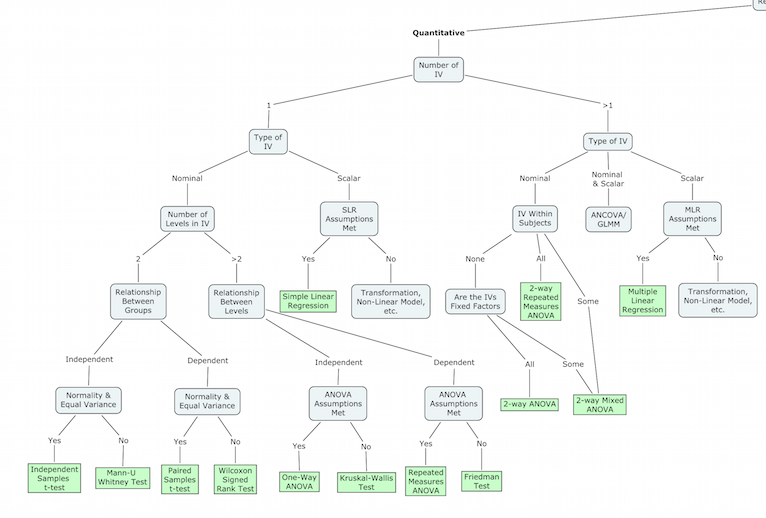


# Conceptual Overview

## Regression and Correlation 

**Regression Analysis** is a way to evaluate the relationship between a set of (one more more) independent variables and a (usually quantitative dependent) variable.

**Simple linear regression** involves modeling a *linear relationship* between a *quantitative* independent variable and a *quantitative* dependent variable. It is used to *predict* or *estimate* a dependent (response) variable from the independent (predictor) variable.

**Correlation** is used to measure the *strength* and *direction* of the linear relationship between two quantitative variables.


## It Must Be Linear!!

When considering either simple linear regression or correlation, step one should **always** be to obtain a scatterplot of the data to see whether a linear regression model is appropriate.

**Plot your data!**

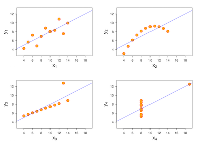


# Correlation

## Correlation Overview

In statistics, the **Pearson product-moment correlation coefficient** (sometimes referred to as Pearson's $r$) is a measure of the linear correlation between two variables. It is widely used in the sciences as a measure of the degree of linear dependence between two variables.

- $r$ is always between –1 and +1 inclusive
- the magnitude of $r$ indicates how close the points are to a straight line.
- the sign indicates the direction of the relationship: does y increase or decrease as 
x increases?
- $r$ = –1  a perfect negative linear relationship (e.g., the points are in a 
perfectly straight line that slopes downward)
- $r$ = +1  a perfect positive linear relationship (e.g., the points are in a 
perfectly straight line that slopes upward)
- $r$ = 0  no linear association between x and y.


## Correlation Formulas

For a population:

$$
	\rho_{X,Y}=\frac{\operatorname{E}[XY]-\operatorname{E}[X]\operatorname{E}[Y]}{\sqrt{\operatorname{E}[X^2]-\operatorname{E}[X]^2}~\sqrt{\operatorname{E}[Y^2]- \operatorname{E}[Y]^2}}
$$

For a sample:

$$
	r = r_{xy} =\frac{\sum ^n _{i=1}(x_i - \bar{x})(y_i - \bar{y})}{\sqrt{\sum ^n _{i=1}(x_i - \bar{x})^2} \sqrt{\sum ^n _{i=1}(y_i - \bar{y})^2}}
$$


## Interpreting Correlation 

Below is a general guide for interpreting strength of $r$ (absolute value): 
(http://faculty.washington.edu/ddbrewer/bls315/b315corr.htm)

* 0.0 - 0.2 = weak, slight 	
* 0.2 - 0.4 = mild/modest         
* 0.4 - 0.6 = moderate 
* 0.6 - 0.8 = moderately strong           
* 0.8 - 1.0 = strong

`R` (and other software) will also allow you to perform hypothesis test to see whether the correlation is *statistically significant*. 

## Correlation in R {.smaller}

Correlation in `R` is computed with the `cor` function. It is commonly called to compute correlation between two numeric vectors:

```{r}
x <- rnorm(25)
y <- rnorm(25)
cor(x, y)
```

It can also be used to get all pairwise correlations in a matrix:

```{r}
mat <- matrix(rnorm(50), ncol = 5)
cor(mat)
```

## Correlation hypothesis testing in R {.smaller}

We can perform a hypothesis test for correlation in `R` with the `cor.test` function. Formally, we are testing:

$$
	H_{0}: r = 0 \\
	H_{a}: r \neq 0
$$


```{r}
x <- rnorm(25)
y <- rnorm(25)
cor.test(x, y)
```

## Non-parametric alt. -- Spearman correlation

Read about it [here](https://en.wikipedia.org/wiki/Spearman%27s_rank_correlation_coefficient). Useful if your relationship is non-linear and/or your samples are not normally distributed. 


```{r}
x <- rnorm(25)
y <- rnorm(25)
cor(x, y, method = 'spearman')

xr <- rank(x)
yr <- rank(y)
cor(xr, yr)
```


# Simple Linear Regression

## Simple linear regression model

The regression of variable $Y$ on variable $X$ is given by:

$$
	y_{i} = \beta_{0} + \beta_{1} x_{i} + \epsilon_{i} \quad i = 1, ..., n
$$

where:

- Random Error: $\epsilon_{i} ~ N(0, \sigma^{2})$, independent

Unknown parameters

- $\beta_{0}$ (Intercept): point in which the line intercepts the y-axis
- $\beta_{1}$ (Slope): increase in $Y$ per unit change in $X$


## Simple linear regression model

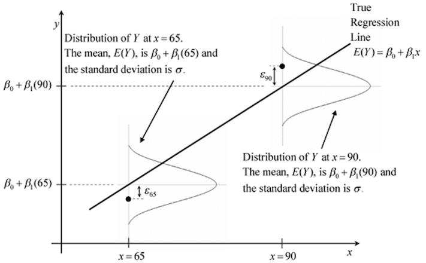


## Estimation of unknown parameters

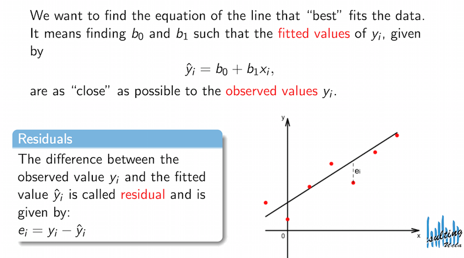

<font size="2">[Source](http://scc.stat.ucla.edu/page_attachments/0000/0188/reg_R_1_09S_slides.pdf)</font>

## Estimation of unknown parameters

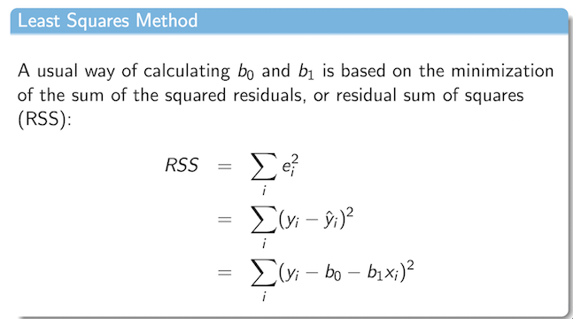

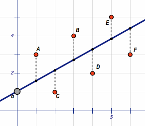

<font size="2">[Source](http://scc.stat.ucla.edu/page_attachments/0000/0188/reg_R_1_09S_slides.pdf)</font>


## Hypothesis testing in regression

Hypothesis testing in simple linear regression tests whether or not the slope of the regression line deviates significantly from zero. Or, more formally:

$$
	H_{0}: \beta_{1} = 0 \\
	H_{a}: \beta_{1} \neq 0
$$


## Hypothesis testing in regression: assumptions

**That the relationship between the variables is approximately linear**


## Hypothesis testing in regression: assumptions

**That the relationship between the variables is approximately linear**

The errors for all observations $i=1, 2,...,n$ in the population with the same value of $X = X_{i}$ are assumed to be 

1. Independent (e.g., one value of does not affect the value of any other),
2. Normally distributed,
3. Have mean 0, and 
4. have the same variance $\sigma_{\epsilon}^{2}$

Checks for these will be shown in the following example


# Hypothesis Testing: Example

## Remember!

The following 5-step outline is a useful way to organize the ideas of hypothesis testing:

1. State the Null and Alternative Hypotheses
2. Check test assumptions
3. Compute the Test Statistic
4. Determine the p-value
5. Draw a conclusion


## Our Example Data Set

Download from [here](https://courses.aquinas.edu/mod/resource/view.php?id=103427) on CourseConnect. A description of the data follows:

*Treadmill stress tests were administered to patients with angina pectoris before and 4 weeks after once-daily dosing with an experimental anti-anginal medication. The investigator wanted to know if the improvement in exercise performance is related to the patient’s disease history. Disease duration since initial diagnosis (in years) and percent-improvement in treadmill walking times were collected during a study enrolling 20 patients.*

```{r}
tread <- read.csv('treadmill.csv')
str(tread)
```


## 1) State the null and alternative hypotheses

Our physician clients would like to test whether there is a linear relationship between disease duration and percent improvement in treadmill walking after medication. 

$$
	H_{0}: \beta_{duration} = 0 \\
	H_{a}: \beta_{duration} \neq 0
$$


## 2) Check test assumptions - Part 1: Linearity

Step 1 should always be a graphical display checking for a linear relationship between our two variables:

```{r, fig.height = 3, fig.width = 4.5}
library(ggplot2)
ggplot(tread, aes(x = duration, y = pctimprvmt)) +
	geom_point() +
	geom_smooth(method = 'lm')

```

## 2) Check test assumptions - Part 2: Residuals 

1. Independent (e.g., one value of does not affect the value of any other),
2. Normally distributed,
3. Have mean 0, and 
4. have the same variance $\sigma_{\epsilon}^{2}$

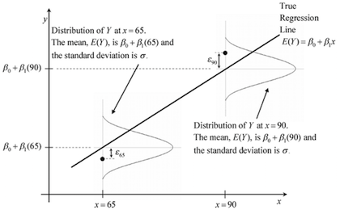


## 2) Check test assumptions - Part 2: Residuals 

**1. Independent (e.g., one value of does not affect the value of any other )**

This condition is satisfied. We have a random sample of patients in our study and the values of one patient should not affect the values of another patient. 

## 2) Check test assumptions - Part 2: Residuals 

To check residual assumptions 2-4, we'll fit a simple linear regression model and pass the fit to `autoplot`.

```{r, fig.height = 3.5, fig.width = 4.5}
library(ggfortify) # install as necessary 
mod <- lm(pctimprvmt ~ duration, data = tread)
autoplot(mod) + theme(text = element_text(size = 9))
```

## 2) Check test assumptions - Part 2: Residuals 

**2. Normally distributed:**

Points on QQ-plot follow the line closely and no outliers are present; our assumption of normality is met. 

```{r, fig.height = 3.2, fig.width = 3.2}
library(ggfortify)
mod <- lm(pctimprvmt ~ duration, data = tread)
autoplot(mod, which = 2)
```

## 2) Check test assumptions - Part 2: Residuals 

**3/4. Have mean 0, and constant variance $\sigma_{\epsilon}^{2}$** 

We look for two main things that cause problems in regression:

1. Outliers: This means that for certain points (values of the independent variable) the variance looks particularly large relative to the other values.

2. Increasing variance: If you have a fan-shaped plot, then you probably have this problem. Essentially the variances are increasing as the X’s are increasing. Ways to address this problem include transformations of the Y variable (e.g., log transformation or square root transformation). 

## 2) Check test assumptions - Part 2: Residuals 

**3/4. Have mean 0, and constant variance $\sigma_{\epsilon}^{2}$** 

We are looking for randomness in these plots. Additionally, points with standardized residuals larger than +/-3 are considered outliers. 

```{r, fig.height = 3.5, fig.width = 7}
autoplot(mod, which = c(1,5))
```

## 3 & 4) Compute the Test Statistic(s) & Determine the p-value(s) {.smaller}

We can call the `summary` function on our `lm` object to get our test statistics and p-values:

```{r}
summary(mod)
```

## 5) Draw a conclusion

**We first look to see if our model fit is significant:**

There is statistically significant evidence (F = 5.74; p = 0.028) that there is a linear relationship between disease duration and percent improvement in treadmill walking after medication.

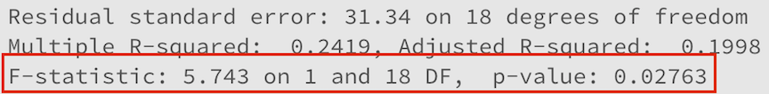


## 5) Draw a conclusion

**We first look to see if our model fit is significant:**

There is statistically significant evidence (F = 5.74; p = 0.028) that there is a linear relationship between disease duration and percent improvement in treadmill walking after medication.


<div class='red2'>If this test is insignificant, there is no need to perform any additional inference on the coefficients.</div>


## 5) Draw a conclusion

**Then we interpret our $\beta_{1}$ coefficient:**

According to this model a one year increase in disease duration is estimated to result in an average decrease of 10.1% in the percentage improvement in treadmill walking.

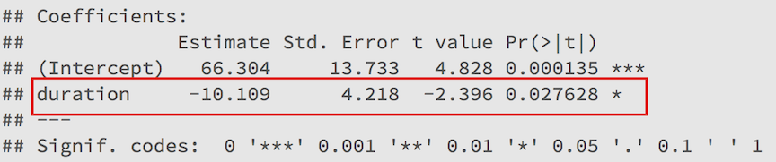


## 5) Draw a conclusion

**Then we provide a confidence interval for the $\beta_{1}$ coefficient:**

```{r}
confint(mod)
```

We are 95% confident that a one year increase in disease duration will result in an average decrease of 1.2% to 19.0% in the percentage improvement in treadmill walking.

## 5) Draw a conclusion

**It is often common to state and interpret the $R^{2}$ value:**

Watch [this video](https://www.khanacademy.org/math/probability/regression/regression-correlation/v/r-squared-or-coefficient-of-determination) for the math behind $R^{2}$.

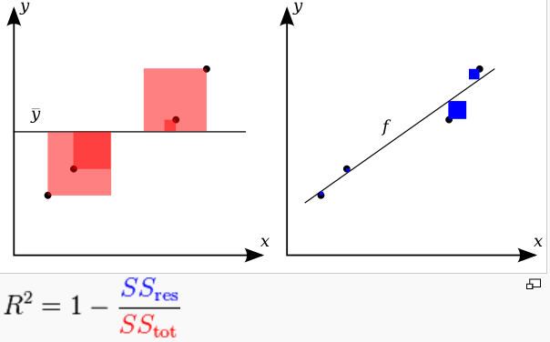


## 5) Draw a conclusion

**It is often common to state and interpret the $R^{2}$ value:**

24.19% of the variation in percentage improvement in treadmill walking is explained by the variation in years of disease duration. 

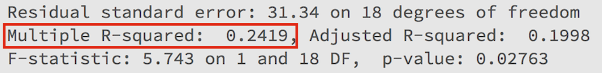


# An Example of Assumptions Being Violated

## The Data

*A group of students were asked on their class survey to give the year of their car (if they have one) and the mileage of their car. We want to determine if there is a linear relationship between a car’s age and its mileage. The code is similar to that of Example 1 except for the different variables. We proceed to the graphs — there will clearly be a problem!*


```{r}
miles <- read.csv('miles.csv')
str(miles)
```

## Check for Linear Relationship

```{r}
ggplot(miles, aes(x = carage, y = carmiles)) +
	geom_point() + 
	geom_smooth(method = 'lm')
```

## Check for Linear Relationship

```{r}
ggplot(miles, aes(x = carage, y = carmiles)) +
	geom_point() + 
	geom_smooth()
```

## Check our Diagnostics

```{r}
mod <- lm(carmiles ~ carage, data = miles)
autoplot(mod)
```


## Questions?


