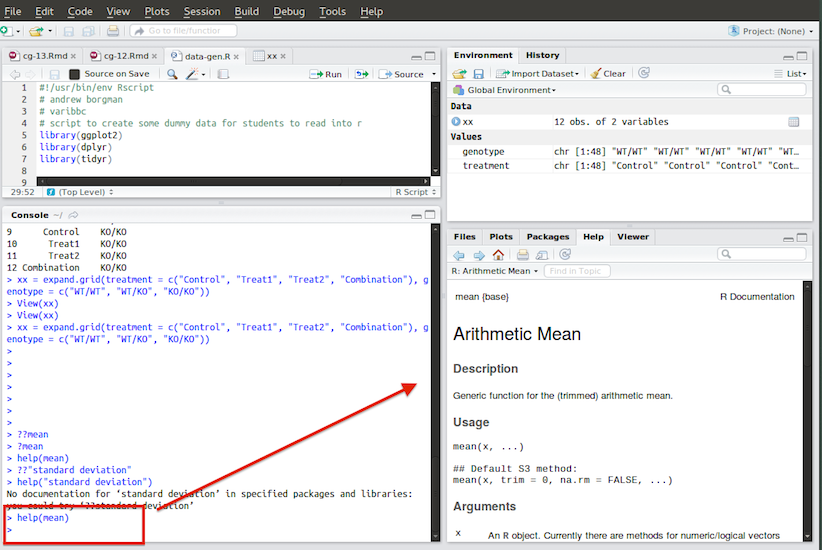

## Instructions

This lab will introduce you to functions in `R`. In each section, you'll be given a set of functions to look up in `R` (the next section will tell you how to do this), Google, or the cheat sheets on CourseConnect.

There are additional homework questions at the end that will ask you general questions about the lecture.

Please put all responses in the same Word document and indicate which section each response corresponds to by including the question number -- e.g. 1), 2)...

Please **convert the completed document to PDF** and upload to the *Lab 2/Homework* section on CourseConnect. Please name the file in the following manner: `week-2-homework-yourlastname.pdf`


## Searching for Help on Functions

As mentioned in the lecture, functions take data as input and transform, manipulate, or analyze that data in some way to produce an output (e.g. statistical results, more data, a graph, etc.)


`R` has built-in documentation for most functions that describes the behavior of the function and what the expected output would be. If you know the name of the function you'd like to look up in the documentation, you can with `?` or `help()`.

Here's how you would search for help on the `mean()` function:

```{r, eval = FALSE}
?mean
# or 
help(mean)
```

Type either of those commands into the `R` console to see the help pages for them. When working in *RStudio*, help pages are displayed in the help pane as shown below.



It is important to note that most help pages include an *Examples* section at the end that show usage examples of the function. These examples are often self contained and can be copy and pasted into the `R` console to demonstrate the behavior of the function. Below is part of the *Examples* section of the `mean()` help page:

```
Examples:

     x <- c(0:10, 50)
     xm <- mean(x)
```

You can probably guess what this function is doing from the name of it. It takes a vector as input and computes the average value.  


## A Note on Arguments

Reading through the help pages, you'll notice lists of *arguments*. Arguments are additional values you can provide to modify the behavior of the function. They are specified in the following manner

```
somefunction(my_data, argument1 = 'yes', argument2 = 'fast')
```

Below is the arguments section from the `mean()` help page:

```
Usage:

     mean(x, ...)

     ## Default S3 method:
     mean(x, trim = 0, na.rm = FALSE, ...)

Arguments:

       x: An R object.  Currently there are methods for numeric/logical
          vectors and date, date-time and time interval objects.
          Complex vectors are allowed for ‘trim = 0’, only.

    trim: the fraction (0 to 0.5) of observations to be trimmed from
          each end of ‘x’ before the mean is computed.  Values of trim
          outside that range are taken as the nearest endpoint.

   na.rm: a logical value indicating whether ‘NA’ values should be
          stripped before the computation proceeds.

     ...: further arguments passed to or from other methods.

```


**********


## Vector Related Functions


### Generating Vectors


#### 1) `rep`

Look up some information about the `rep` function and look at it's example uses. Figure out how to use `rep` to create the following vectors. Paste your code for the two `rep` statements into a word document along with the output of the function:

```
c("a", "a", "a", "b", "b", "b", "c", "c", "c")
c("a", "b", "c", "a", "b", "c", "a", "b", "c")
```

#### 2) `seq`

Look up some information about the `seq` function and look at it's example uses. Figure out how to use `seq` to create the following vectors. Paste your code for the two `seq` into a word document along with the output of the function:

```
c(-9, -6, -3, 0, 3, 6, 9)
c(100, 200, 300, 400, 500, 600, 700, 800, 900, 1000)
```

#### 3) `rnorm`

`R` makes it easy to generate values from random variables. `rnorm` allows you to draw random numbers from a normal distribution.

Look up some information about the `rnorm` function and figure out how to draw 100 observations from a normal distribution the mean 5 and standard deviation 10. Assign the output of your `rnorm` statement to a variable named `my_sample`. Use the following code to make a histogram of your 100 observations:

```{r, eval = FALSE}
hist(my_sample)
```

Paste your code to generate the observations and the histogram you generated into your Word document. Also comment on whether or not the histogram looks like a normal distribution.


### Summarizing Vectors

#### 4) `length`

Read about the `length` function. Use it to check the length of the vector you created for question 3) to confirm there are indeed 100 elements in the vector. Paste your code and output into the Word document.

#### 5) `mean`

Read about the `mean` function. Use it to check how close the mean of your 100 values is to the theoretical mean of the distribution you drew the sample from in question 3). Paste your code and output into the Word document.

#### 6) `median`

Read about the `median` function. Use it to find the median of the vector `my_sample`. Paste your code and output into the Word document.


#### 7) `range`

Read about the `range` function. Use it to find the range of the vector `range`. Paste your code and output into the Word document and comment on how this function's output differs from the other summary functions in this section.


********


## Matrix Related Functions


### Generating Matrices


#### 8) Random Normal Matrix

Use the `rnorm` function to generate a 80 draws from a standard normal distribution (N(0,1)) and save the result to a vector. Use `dim` to transform this vector into a matrix with 8 rows and 10 columns. Paste your code and output into the Word document.


### Summarizing Matrices

#### 9) `length`, `nrow`, `ncol`

Read about the functions `nrow` & `ncol`. Run `length`, `nrow`, and `ncol` using the matrix you created in 8) as input. Paste your code and output into the Word document.

#### 10) `colSums`, `colMeans`, `rowSums`, `rowMeans`

Read about the following functions: `colSums`, `colMeans`, `rowSums`, `rowMeans`.

Run each of them on the matrix you created in 8) and, for each function, describe it's behavior and the output it generated.

******

## Data Frame Related Functions


### Generating Data Frames

#### 11) `length`, `nrow`, `ncol`

Run the following code to create a data frame:

```{r, eval = FALSE}
trials <- data.frame(
	Response = rnorm(15), 
	Treatment = rep(c('a', 'b', 'control'), length.out = 15)
	)
```

Run `length`, `nrow`, `ncol` and describe how these values are similar or different to those produced when the functions are run on matrices. If the values seem different, explain why that might be the case. 


******


## Homework Questions


#### 12)

Load the built in data set `PlantGrowth`. Write an `R` statement that uses a logical operators to select all rows of the data frame where `weight` is greater than 5. Paste your code and output into the Word document. (Review slide 66 of the class presentation to see how to subset a data frame using logical operators.)


#### 13) 

We learned in class how to add and remove elements of a list (review slides if necessary). Copy and paste the following code into `R` to create a data frame

```{r, eval = FALSE}
expt_data <- data.frame(
	group = rep(c('treatment', 'control'), each = 20),
	blood_pressure = rnorm(40),
	mortality = sample(rep(c('yes', 'no'), each = 20))
	)
```

print this object to the screen to see what we have created. Recall that the columns of a data frame are really just elements of a list. Use this knowledge to add a column to the data frame called `study_id` that is an integer value that runs from 1 to 40 (hint: `1:40`). **Copy and paste the code to do this into the Word Document.**

Now you decide you don't care about blood pressure and want to delete it from your data frame. Use the example of deleting an element from a list to delete the `blood_pressure` column from the database. **Copy and paste the code to do this into the Word Document.**


#### 14) 

Why is 1 == "1" true? Why is -1 < FALSE true? Why is "one" < 2 false? Hint: see slides on coercion.


#### 15)

What does dim() return when applied to a vector?


#### 16) 

If is.matrix(x) is TRUE, what will is.array(x) return?


#### 17) 

How would you describe the following three objects? What makes them different to 1:5?

```{r, eval = FALSE}
x1 <- array(1:5, c(1, 1, 5))
x2 <- array(1:5, c(1, 5, 1))
x3 <- array(1:5, c(5, 1, 1))
```

