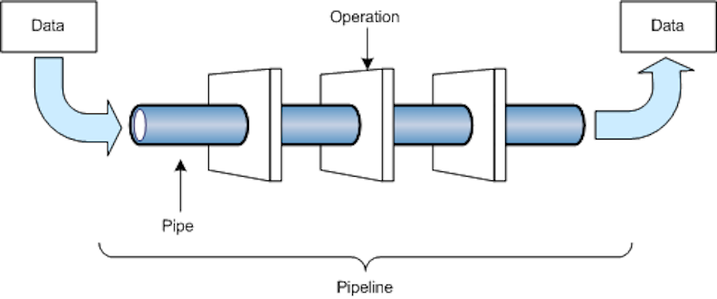
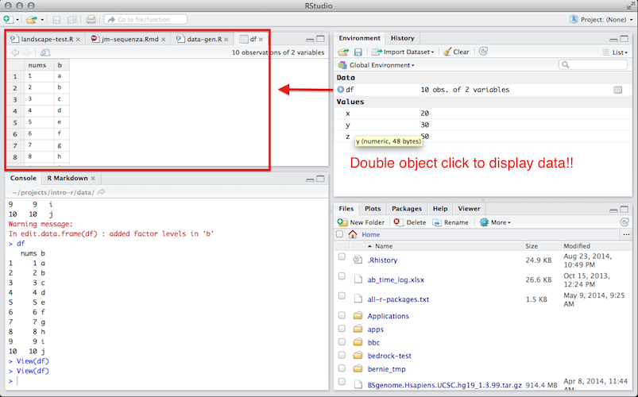
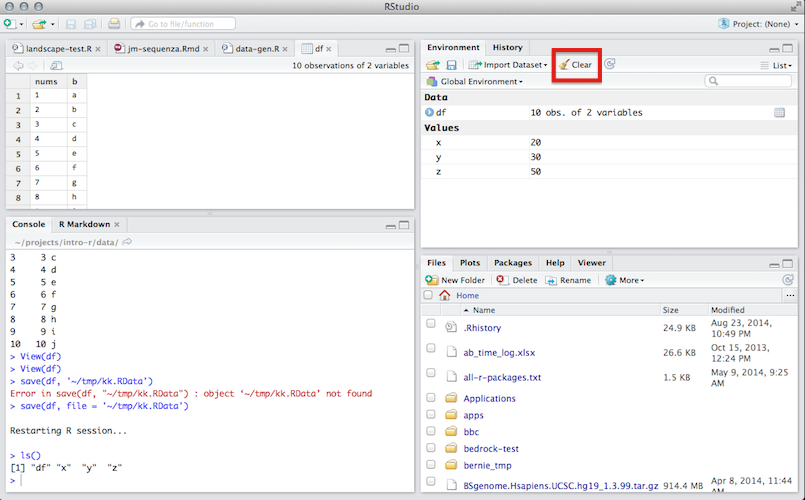

## Overview

- Functions & data
- `R` data structures
- `R` operators
- `R` functions
- The `R` workspace
- Built in data


# Quick Review

## Assignment

* Values in `R` are assigned to **variables**
    - "`<-`" is known as the *assignment operator*
    - The *assignment operator* assigns values to variables

```{r}
x <- 3
```

<div class='red2'>
*Today we will learn about different types of these variables*
</div>


# Functions & Data


## It's all about functions and data

2 sorts of things (**objects**): **data** and **functions**

- **Data**: things like 7, "seven", $7.000$, the matrix $\left[ \begin{array}{ccc} 7 & 7 & 7 \\ 7 & 7 & 7\end{array}\right]$
- **Functions**: things like $\log{}$, $+$ (two arguments), $<$ (two), $\mod{}$ (two), `mean` (one)


## The Applied Statistics Pattern

Applied statisticians write `functions()` that take `data` and transform, manipulate, or analyze it in some way to produce output or results. A majority of the time is spent [wrangling](https://en.wikipedia.org/wiki/Data_wrangling) data.





# First, some data

## R Data Types

Objects in *R* can be a number of different types. These are types you are most likely to encounter:

1. **Character**: character objects are letters, words, or strings.
	- Ex: `'j'`, `'hello'`, `'treatment A'`
2. **Numeric**: numeric objects are integers or real numbers
	- Ex: `1`, `550`, `3.14`
3. **Logical**: logical objects take the value of `TRUE` and `FALSE` and are often used to control programming flow
4. **Missing or ill-defined values**: `NA`, `NaN`, etc.


## Arithmetic Operators

```{r}
7 + 5
7 - 5 
7 * 5
7 ^ 5
```

## Arithmetic Operators (cont.)

```{r}
7/5
7 %% 5 # modulo division
7 %/% 5 # integer division
```

## Comparison Operators

```{r}
7 > 5
7 < 5
7 >= 7
7 <= 5
```

## Comparison Operators (cont.)

```{r}
'a' < 'b'
'a' > 'b'
'A' > 'a'
'A' < 'a'
```


## Equality Operators

```{r}
7 == 7
7 == 5
'one' != 1
'one' == 'one'
```

## Boolean operators

Basically "and" and "or":

```{r}
(5 > 7) & (6*7 == 42)
(5 > 7) | (6*7 == 42)
```

*Remember [De Morgan's Laws](https://en.wikipedia.org/wiki/De_Morgan%27s_laws) from discrete math.*


## Checking Types

- `typeof()` function returns the type
- more on the topic [here](http://stackoverflow.com/questions/6258004/r-types-and-classes-of-variables) and [here](https://www.mail-archive.com/r-help@r-project.org/msg17169.html)
- `is.`_foo_`()` functions return Booleans for whether the argument is of type _foo_

----

```{r}
typeof(7)
is.numeric(7)
is.na(7)
is.na(NA)
```

----

```{r}
is.character(7)
is.character("7")
is.character("seven")
is.na("seven")
```


# Data Structures

## `R` Data Structures

```{r, results='asis', echo=FALSE}

cout <- data.frame(
	Homogeneous	= c("Atomic Vector", "Matrix", "Array"),
	Heterogeneous = c("List", "Data Frame", "")
	)

rownames(cout) <- c('1d', '2d', 'nd')

knitr::kable(cout)

```

# (Atomic) Vectors

## Vectors

Vectors are *R*'s most basic data structure. When we created the variable `x` in the review section, we had actually created a *vector* of length 1. The elements contained in a vector must be of the same *type* (see prev. section). Vectors including more than one element are frequently constructed using the `c()` (concatenate) function:

```{r}
a <- c(1, 2, 5.3, 6, -2, 4) # numeric vector
b <- c("one", "two", "three") # character vector
c <- c(TRUE, TRUE, TRUE, FALSE, TRUE, FALSE) # logical vector
is(a)
is.vector(a)
```


## Accessing values in vectors

- `[` is used to select elements of a vector
- `x[1]` is the first element, `x[4]` is the 4th element
	+ note that `R` is one-based unlike many languages
- `x[-4]` is a vector containing all but the fourth element

```{r}
x <- c(7, 8, 10, 45)
x[1]
x[-4]
```

## Accessing values in vectors

You can also supply a vector of indices to index with:

```{r}
x[c(2,4)]
```

This works with negative values too:

```{r}
x[c(-1,-3)]
```


## Accessing values in vectors

Boolean vectors can be used for selection as well:

```{r}
x[c(TRUE, FALSE, FALSE, FALSE)]
x > 9
x[x > 9]
```

## Accessing values in vectors

Often chaining together complex boolean rules is useful

```{r}
x[(x > 7) & (x < 45)]
```


## Vector arithmetic

Operators apply to vectors "pairwise" or "elementwise":

```{r}
y <- c(-7, -8, -10, -45)
x + y
x * y
```

## Recycling

Vector operations in `R` *recycle* values.

**Recycling** repeats elements in shorter vector when combined with longer

```{r}
x + c(-7,-8)
x^c(1,0,-1,0.5)
```

## Recycling

Single numbers are vectors of length 1 for purposes of recycling (scalar multiplication):

```{r}
2*x
```

## Checking Equality

To compare whole vectors, best to use `identical()` or `all.equal()`:

```{r}
x == -y
identical(x,-y)
all.equal(x,-y)
```


## Named components

You can give names to elements or components of vectors; you can subset by these

```{r}
names(x) <- c("v1", "v2", "v3", "fred")
x
names(x)
x[c("fred","v1")]
```

## Coercion

- All vector elements must be same type
- Attempting to combine different types will *coerce* all values to the most flexible type
- Flexibility order from (least to most): logical, integer, double, and character.
- For example, combining a character and an integer yields a character:

```{r}
c("a", 1)
c(TRUE, 0)
```


# Side Note: Factors

## What is a Factor

- `R`'s way of representing [categorical/nominal](http://www.ats.ucla.edu/stat/mult_pkg/whatstat/nominal_ordinal_interval.htm) variables
- Useful if you want to restrict values of a vector (i.e. sex, study group)
- We will avoid them for the first part of the course
- But will illustrate their usefulness later

## What is a Factor

Say you have a study with three groups:

```{r}
group <- c(1, 1, 1, 2, 2, 2, 3, 3, 3)
```

This probably doesn't make sense:

```{r}
group + 2
```

## What is a Factor

Solution: `factor()`

```{r}
group <- as.factor(group)
group
is(group)
```

## What is a Factor

Now values in vector can only be `1`, `2`, or `3` (and addition doesn't work)

```{r}
group[1] <- 4
group
```

The allowed values are known as the `levels`


## What is a Factor

Even though `group` `is()` numeric, addition is no longer allowed

```{r}
group + 2
```


# Lists

## Lists

Lists are different from atomic vectors because their elements can be of any type, including lists. You construct lists by using list() instead of c():

```{r}
x <- list(1:3, "a", c(TRUE, FALSE, TRUE), c(2.3, 5.9))
str(x)
```

## Lists

```{r}
nested_lists <- list(list('hello', 'goodbye'), "a", list('test', 'test2'))
str(nested_lists)
```

## Lists Can Have Names Too

```{r}
named_list <- list(element_one = 1:3, two = c(TRUE, FALSE, TRUE), 
					bike = c('wheel', 'brakes'))
str(named_list)
names(named_list)
```


## Accessing Values in Lists

Can access by index using ``[[``

```{r}
named_list[[2]]
named_list[[3]]
```

## Accessing Values in Lists

or by name

```{r}
named_list[['two']]
named_list[['bike']]
```

## Combining Lists

- use the `c()` function to combine multiple lists
- `c(list, list)` returns another list

```{r}
combined_list <- c(x, named_list)
str(combined_list)
```

## The `$` Shortcut

The `$` symbol can be used as an extraction operator (like `[[`) on lists. The basic usage is as follows

```{r}
named_list[['bike']]
named_list$bike
identical(named_list[['bike']], named_list$bike)

```

## The `$` Shortcut

I suggest **not** to using the `$` shortcut as it can introduce bugs in your code if list names have spaces in them. 

```{r}
test <- list(1, c(3, 4))
names(test) <- c('element_one', 'element two')
test[['element two']]
```

```{r, eval = FALSE}
test$element two
```

```
Error: unexpected symbol in "test$element two"
```


## Adding Elements to a List

This can be done using the concatenate (`c()`) operator:

```{r}
named_list <- c(named_list,'dog')
str(named_list)
```

## Adding Elements to a List

Or by indexing (by any method) a slot (possibly new) and writing data to it

```{r}
named_list$new_slot <- c(1,2,9)
str(named_list)
```

## Removing Elements from a List

To remove an element, index the element you would like to remove and set it to `NULL`

```{r}
named_list[[4]] <- NULL
str(named_list)
```


# Matrices & Arrays 

## Matrices & Arrays 

- Matrices & arrays are just vectors that have **dimensions**
- Since they are vectors, they can only 1 one data type
	+ same coercion rules apply
- Dimension is controlled by the `dim()` attribute of a vector 
- A matrix is a special case of an array with exactly two dimensions
- Matrices are used commonly in statistics; you will see them often
- Arrays are much rarer, but worth being aware of

## Creating Matrices & Arrays 

Matrices are created with `matrix()`

```{r}
a <- matrix(1:6, ncol = 3, nrow = 2)
a
is(a)
```

## Creating Matrices & Arrays 

Arrays are created with `array()`; vector 

```{r}
b <- array(1:12, c(2, 3, 2))
b
```


## Creating Matrices & Arrays 

They can also be created using the assignment form of dim():

Adding 2 dimensions gives you a matrix:

```{r}
# You can also modify an object in place by setting dim()
c <- 1:6
dim(c) <- c(3, 2)
c
```

## Creating Matrices & Arrays 

Adding 3 or more dimensions gives you an array:

```{r}
d <- 1:12
dim(d) <- c(2, 3, 2)
d
```

## Accessing Values in Matrices & Arrays 

- Use `[` again to access values
- Need to provide enough indices for each dimension
- For matrices, subset as `a[row, column]`

```{r}
a
a[1, 3]
```

## Accessing Values in Matrices & Arrays 

If you omit an index, all values from that dimension are selected

```{r}
a[1,]
a[,3]
```


# Data Frames

## Data Frames

- The data frame is the most common way to store data in `R`
- Data frames look like matrices; but columns can have different types
- A data frame is actually a list of equal-length vectors
- Can be created manually with `data.frame`
- Created by default by data import functions


## Creating Data Frames

```{r}
df <- data.frame(x = 1:3, y = c("a", "b", "c"))
df
is(df)
```


## Creating Data Frames

`R` will throw an error if the vectors have unequal length

```{r, eval = FALSE}
df <- data.frame(x = 1:4, y = c("a", "b", "c"))
```

```
Error in data.frame(x = 1:4, y = c("a", "b", "c")) :
  arguments imply differing number of rows: 4, 3
```

## Creating Data frames

You can also create data frames from vectors already in your environment

```{r}
a <- 1:3
b <- letters[1:3]
my_df <- data.frame(a, b)
my_df
```


## Creating Data frames

Beware `data.frame()`’s default behavior which turns strings into factors. Use stringAsFactors = FALSE to suppress this behavior:

```{r}
df <- data.frame(x = 1:3, y = c("a", "b", "c"))
str(df)

df <- data.frame(x = 1:3, y = c("a", "b", "c"), 
					stringsAsFactors = FALSE)
str(df)
```

## Subsetting a Data Frame

Data frames can be subset using numeric indices's just like matrices

```{r}
df[1,2]
df[3,]
is(df[3,])
```

## Subsetting a Data Frame

You can also use names and logical indexes:

```{r}
df[ ,'x']
is(df[ ,'x'])
df[df[,'x'] < 3, ]
```


```{r, include = FALSE}
rm(list = ls(all = TRUE))
```


# The `R` Workspace

## Defining & Viewing the Workspace

The *R* workspace can be thought of as a container holding all of the objects you've created during your *R* session. You can print a list of all of the objects in your current workspace using the `ls()` function. If we start a new *R* session, our workspace will be empty:

```{r}
ls()
```

## Viewing Your Workspace in `R`

And we'll be able to see some objects if we add them:

```{r}
x <- 20
y <- 30
z <- x + y
df <- data.frame(nums = 1:10, b = letters[1:10])
ls()
```

## Viewing Your Workspace in *RStudio*


## Viewing Your Data in *RStudio*



## Saving Your Workspace for Later

* `save.image`: saves a snapshot of entire workspace to a file
    - Typical usage: `save.image('my-work.RData')`
* `save`: saves a snapshot of a few specified objects to a file.
    - Useful if you only want to save one or 2 things (like a modified data set).
    - To save, `df`, the `data.frame` we created in the last section: 
    - `save(df, file = 'my-dataframe.RData')`
* `load`: loads your saved `*.RData` files back in to *R*
    -  To load, `df`, the `data.frame` we just saved: 
    - `load('my-dataframe.RData')`

## Clearing Your Workspace

* There are two main ways to clear your workspace in *R*/*RStudio* 
    1. using the `rm()` function to remove objects and 
    2. using the *Clear* button in *RStudio*. 
* `rm()` lets you remove objects from your *R* session when they aren't needed
* Example of the usage:

```
> ls() # start in an empty workspace
character(0)
> y <- 1
> z <- 1
> ls() # can see the two objects we created
[1] "y" "z"
> rm(y) # remove y
> ls()  
[1] "z"
```

## Clearing Your Workspace

You can remove *all* objects in your workspace by using `ls()` to generate a vector of all the objects that have been created, and passing that to the `rm()` function:

```{r}
rm(list = ls(all = TRUE))
```

You can also use a button in *RStudio*'s *Environment* panel to remove all of the objects in your workspace. *RStudio* will prompt you asking if you are sure you want to go through with deleting all objects, choosing *Yes* will permanently delete all objects in the workspace.




# Built In Data

## Built In Data

`R` has a number of built in data sets one can access. Built in data is loaded using the `data()` function. Running `data()` with no arguments lists all available data sets. Running `data()` with a valid name of a data set loads that data into the workspace:


```{r}
ls()
data(ChickWeight)
ls()
```


# Finally, some functions. To the Lab!

