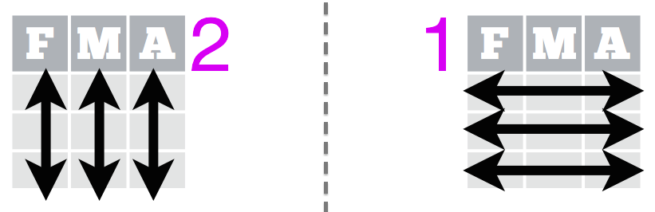

```{r config, include = FALSE}
# knitr::opts_chunk$set(cache = TRUE)
```

# Questions?


## Before we get started -- comments

- The `#` character allows you to make **comments** in your `R` code
- Comments are lines of text that are read but not evaluated by `R`
- Comments are used to add notes to your code to add context 
- We'll talk more about them next week

## Before we get started -- scripts

`R` scripts are text files with the file extension `.R`. An example would be something like: `my-script.R`. Scripts will often contain **related** sets of functions and code. 

## Overview

- Control Flow
- Looping the `R` way with *ply functions


# Control Flow


## Control Flow

- [Control Flow](https://en.wikipedia.org/wiki/Control_flow) contstructs can be thought of as building blocks
- They allow you to specify complex rules/behavior of `R` code
- Invoked with *reserved* words in `R`

```{r, eval = FALSE}
?`if`
```

## `if`, `else if`, `else`

- similar to other languates, `R` allows for `if.. else...` blocks
- the general structure is as follows:

```{r, eval = FALSE}
if (condition_one) {
  # do this if condition_one == TRUE
} else if (condition_two) {
  # do this if condition_one == FALSE
  # and condition_two == TRUE
} else {
  # do this if condition_one == FALSE & 
  # condition_tow == FALSE
}

```

-------

A trivial example:

```{r}
x <- 0
if (x < 0) {
   print("Negative number")
} else if (x > 0) {
   print("Positive number")
} else {
  print("Zero")
}   
```

## Loops

- we'll typically use `if.. else...` blocks inside of *loops*
- *loops* are used in programming to repeatedly perform something
- `R` has three types of loops
    - `for`
    - `while`
    - `repeat`


## `for` loops

- similar to `for` loops in other languages
- useful for iterating over things we want to *do* something to

the syntax is:

```{r, eval = FALSE}
for (var in seq) {
  # do something
}
```

## `for` loop schematic

<div style="text-align:center">

</div> 


--------

```{r, eval = FALSE}
for (var in vec) {
  # do something
}
```

- `vec` is a `vector` of something to iterate
    - determines what values var will take in the loop
- loop is performed length(vec) times
- On the `n`’th iteration of the loop, `vec` takes the value `vec[n]`
- `var` is a completely new variable and not related to any other variable (scoping)


------

A very basic example -- print the numbers from 1 to 5:

```{r}
for (i in 1:5) {
  print(i)
}
```

------

Another basic example -- cumulative sums:

```{r}
running_total <- 0
to_sum <- seq(10, 1000, 22)
for (value in to_sum) {
  running_total <- running_total + value
}
running_total
```

------

Cumulative sums -- alternative approach

```{r}
running_total <- 0
to_sum <- seq(10, 1000, 22)
for (i in 1:length(to_sum)) {
  running_total <- running_total + to_sum[i]
}
running_total
```


## Nesting Loops

You can loop nest another loop with in a loop

```{r}
for(i in 1:3) {
  for(j in 1:2) {
    print(paste0('i = ', i, '; j = ', j))
  }
}
```

## Nesting Loops

Often used for populating matricies

```{r}
ctr <- 1
mat <- matrix(NA, ncol = 3, nrow = 2)
for(i in 1:2) {
  for(j in 1:3) {
    mat[i, j] <- ctr
    ctr <- ctr + 1
  }
}
mat
```

## Loops & `if.. else...`

You will mix loops with `if.. else...` blocks often. Here we use the two to print out all the even numbers between 1 and 10:

```{r}
for (i in 1:10) {
  if (i %% 2 == 0) {
    print(i)
  }
}
```

## `for` Loops -- Why?

- [don't repeat yourself (DRY)](https://en.wikipedia.org/wiki/Don%27t_repeat_yourself)
- makes the code more compact, readable and maintainable and 
- usually saves you some typing and effort


## `while` Loops

- `while` loops repeatedly evaluate an expression until a condition becomes false
- the basic syntax is as follows

```{r, eval = F}
while (some_condition) {
  # keep running this until 
  # some_condition is FALSE
}
```

## `while` loop schematic

<div style="text-align:center">

</div>

## `while` loop examples

```{r}
i <- 1
while (i < 6) {
   print(i)
   i <- i + 1
}
```


## `break` -- getting out of loops early

- `break` can be used to jump out of loops early
- when `break` is encountered, `R` jumps out of the loop into the enclosing expression

```{r}
x <- 1:5
for (val in x) {
  if (val == 3) {
      break
  }
  print(val)
}
```

## `next` -- skipping an iteration in a loop

```{r}
x <- 1:5
for (val in x) {
    if (val == 3) {
        next
    }
    print(val)
}
```


## `repeat` loops

- `repeat` loops let you repeat the same chunk of code over an over
- used much less frequently than other two types of loops
- need to hard code a stopping condition (or else!)

```{r, eval = FALSE}
repeat {
  # do this over and over until 
  # stop_condition == TRUE

 if (stop_condition) {
    break # breaks repeat loop
 }
}
```


# Learning About the `*ply` Family 

## The `*ply` family

There are many members of the `*ply` family. Here's a brief description of each one:

- `apply`: Apply Functions Over Array Margins
- `lapply`: Apply a Function over a List or Vector
- `sapply`: Apply a Function over a List or Vector
- `tapply`: Apply a Function Over a Ragged Array
- `replicate`: The oddly named one...


## `apply`

`apply` lets us *apply* a function to rows or columns of a matrix (or other dimensions of an array). The basic usage is:

```
apply(X, MARGIN, FUN, ...)
```

<div style="text-align:center">

</div>

## `apply` example -- replicating `colSums`

```{r}
mat <- matrix(rnorm(200), nrow = 20, ncol = 10)
col_sums <- apply(X = mat, MARGIN = 2, FUN = sum)
all(col_sums == colSums(mat))
```

## `apply` example -- replicating `rowSums`

```{r}
row_sums <- apply(X = mat, MARGIN = 1, FUN = sum)
all(col_sums == colSums(mat))
```

## lapply and sapply {.smaller}

- `lapply` & `sapply` are more or less the same function under the hood. 
- `sapply`, by default, will tries to *simplify* output 
- both apply a function to each element of a vector or list

```{r}
my_vec <- seq(0, 30, 6)
lapply(my_vec, is.numeric)
```

## lapply and sapply cont. {.smaller}

```{r}
sapply(my_vec, is.numeric)
sapply(my_vec, is.numeric, simplify = FALSE)
unlist(lapply(my_vec, is.numeric))
```

## lapply and sapply cont. {.smaller}

```{r}
unlist(lapply(my_vec, is.numeric))
```

## `tapply`

- `tapply` applies a function to subsets of a vector. 
- Often used for computing summary statistics

```{r}
tapply(iris$Petal.Length, iris$Species, mean)
tapply(iris$Petal.Length, iris$Species, sd)
```


## To the lab...

[link](https://courses.aquinas.edu/pluginfile.php/116697/mod_resource/content/4/week-3-lab-homework.html)


