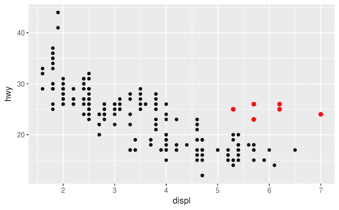
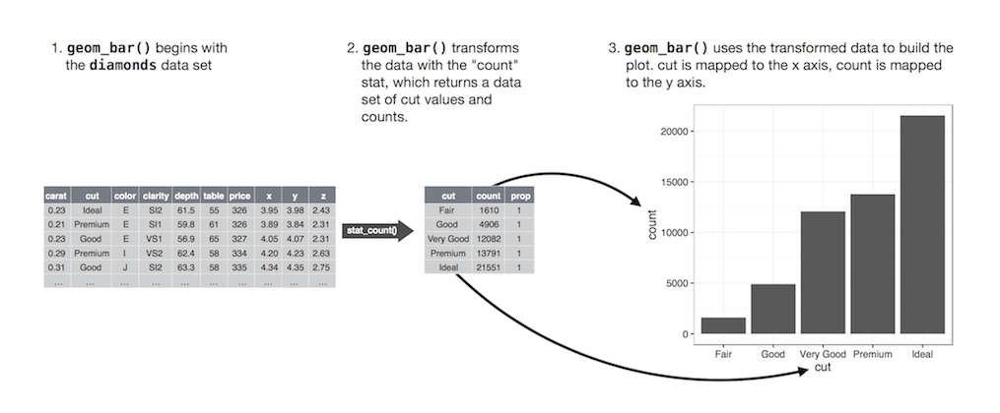

```{r config, include = FALSE}
knitr::opts_chunk$set(error = TRUE, fig.align = 'center')
library(ggplot2)
```

# Questions

## Outline

- Data import & export
- Graphics in `R`


# File System Refresher

## Finding Out Where You Are

- `getwd` 
- `dir`
- `list.files`/`list.dirs`


## Moving to Another Folder

- `setwd()`
- `~`
- `../`


# Types of Data Sources

## Data is Everywhere

- Hand written notes on forms or surveys
- All over the web
    * Web pages & APIs
- Stored in databases
- Stored in structured files
- Comes in many shapes and sizes!
    * (some `R` friendly, some not...)


## Some Notes *Nice* Data

- When starting out, use spreadsheets :)
- First row is usually reserved for the *header*
    - Short names are preferred over longer names
    - Try to avoid using names that contain spaces or symbols like `?`, `$`, `%`, `^`, `&`, `*`, `(`, `)`, `-`, `#`, `?`, `,`, `<`, `>`, `/`, `|`, `\`, `[` , `]`, `{`, and `}`
- First column is *sampling unit* (patient, school, dog, etc.)
- Make sure all data is recorded in a way that `R` can interpret
    * I.e. don't use coloring or highlighting to differentiate (use another variable)
- Make sure that any missing values in your data set are indicated with `NA`

# Manually Entering Data

## Typing Data Into `R`


`R` has a simple spreadsheet-style data editor you can use for small data sets. To use it, create an empty data frame, then pass it to the `fix` function:

```{r, eval = FALSE}
mydata <- data.frame (id=0)
fix (mydata)
```

## Typing Data Into `R`

Reminder: Can also define your data in `R` scripts. Build up a bunch of vectors with `c()`; combine to make them a `matrix` or a `data.frame`.

While both of these approaches work, I would advise against using them. 

# Text Files

## What Are Delimited Text Files?

- Files that use a character (*delimiter*) separate each value. 
- Common choices are spaces, tabs, or commas (but you can use anything)
- Rows of data are separated by newlines or carriage returns `\n`, `\r\n` (`ENTER`)
- Demo Time: Exporting these from Excel

## `read.csv`

You can read comma separated files (CSVs) with `read.csv`

```{r}
my_df <- read.csv("data/chronic_kidney_disease.csv")
```

- `header = TRUE`
- `sep = ","`
- `quote = "\""`
- `dec = "."`


## `write.csv`

We can write `data.frame`s out to CSV files with `write.csv` 

```{r}
write.csv(my_df, "data/created/chronic_kidney_disease.csv")
```

- `quote = TRUE`
- `sep = ","`
- `eol = "\n"`
- `na = "NA"`
- `dec = "."`


## what changed?

we now have an extra column in `my_df2`?

```{r}
my_df2 <- read.csv("data/created/chronic_kidney_disease.csv")
identical(my_df, my_df2)
```

```{r, eval = FALSE}
str(my_df)
str(my_df2)
```

## arguments!

```{r, eval = FALSE}
?write.csv
?read.csv
```

```{r}
write.csv(my_df, "data/created/chronic_kidney_disease.csv", row.names = FALSE)
my_df2 <- read.csv("data/created/chronic_kidney_disease.csv")
identical(my_df, my_df2)
```


## `write.table`

- `write.table` is *father* of the `write.*` functions
- can be used to write out all kinds of files
- here we'll create a space-delimited text file 

```{r}
write.table(my_df, "data/created/chronic_kidney_disease.txt")
```

- `quote = TRUE`
- `sep = " "`
- `eol = "\n"`
- `na = "NA"`
- `dec = "."`


## `read.table`

- `read.table` is the equivalent *father* function for reading data

```{r}
my_df3 <- read.table("data/created/chronic_kidney_disease.txt")
```

- `header = FALSE`
- `sep = ""`
- `quote = "\"'"`
- `dec = "."`


## `read.delim`

`read.delim` is a special function for tab-delimited files (i.e. `sep = '\t'`)

```{r}
write.table(my_df, "data/created/chronic_kidney_disease.tsv", sep = "\t")
my_df4 <- read.delim("data/created/chronic_kidney_disease.tsv")
```

- `header = TRUE`
- `sep = "\t"`
- `quote = "\"'"`
- `dec = "."`


## useful `read.*` arguments

- `colClasses` -- zipcode example
- `skip`
- `strip.white`
- `comment.char`

# Excel Files

## Excel Files

- The old solution was to use the [`xlsx` package](https://cran.r-project.org/web/packages/xlsx/index.html)
    * Powerful solution; very functional if you can get installed
    * Dependent on *java* which can cause some headaches
- New solution, [`openxlsx`](https://cran.r-project.org/web/packages/openxlsx/index.html) to write and [`readxl`](https://cran.r-project.org/web/packages/readxl/index.html)
    * New implementations with no external deps
    * I use these 99% of the time
    * And they're faster!

## Writing Excel Files

```{r}
library(openxlsx)
write.xlsx(my_df, "data/created/chronic_kidney_disease.xlsx", colNames = TRUE)
```


## Reading Excel Files

```{r}
library(readxl)
my_df6 <- read_excel("data/created/chronic_kidney_disease.xlsx")
head(my_df6)
```

# Databases

## `R` Has Support for *Most* Databases

- Can access both local and remote databases
- SQLite, MySQL, PostgreSQL
- MongoDB, Redis, CouchDB
- Google whatever you are using, there is probably an `R` package for it!

## More Data Import Resources

- [Comprehensive Guide for `R` Data Imports ](https://cran.r-project.org/doc/manuals/r-release/R-data.html)
- [Importing data with RStudio](https://support.rstudio.com/hc/en-us/articles/218611977-Importing-Data-with-RStudio)


# Graphics Systems in `R`

## Graphics in `R`

There are three main graphing frameworks available in `R` for creating high quality plots:

1. [Base Graphics](http://www.statmethods.net/graphs/)
2. [Lattice Graphics](http://www.statmethods.net/advgraphs/trellis.html)
3. `ggplot2` Graphics

<div class='red2'>
**All are great, but we're going to focus on `ggplot2`!**
</div>

## `ggplot2`

`ggplot2` is a plotting system for R, based on the grammar of graphics, which tries to take the good parts of base and lattice graphics and avoid bad parts. It takes care of many of the fiddly details that make plotting a hassle (like drawing legends) as well as providing a powerful model of graphics that makes it easy to produce complex multi-layered graphics.

```{r, eval = FALSE}
install.packages('ggplot2')
library(ggplot2)
```


## Example Data Set {.smaller}

```{r}
head(mpg)
```

Analysis Question:

*Do cars with big engines use more fuel than cars with small engines? You probably already have an answer, but try to make your answer precise. What does the relationship between engine size and fuel efficiency look like? Is it positive? Negative? Linear? Nonlinear?*

## Our First `ggplot`

```{r}
ggplot(data = mpg) + 
  geom_point(mapping = aes(x = displ, y = hwy))
```


## Our `ggplot` Template

```{r, eval=F}
ggplot(data = <DATA>) + 
  <GEOM_FUNCTION>(mapping = aes(<MAPPINGS>))
```

- `<DATA>`: a `data.frame` of data you'd like to plot
- `<GEOM_FUNCTION>`: the type of plot you want to make; we'll cover these in detail today
- `<MAPPINGS>`: *aesthetic mappings* that tell `ggplot` how it should plot your data. answers questions like:
    - what is the x variable?
    - what is the y variable?
    - how should points be colored?
    - do sets of points come from the same observation?
    

## Aesthetic mappings -- why?



<bquote>
“The greatest value of a picture is when it forces us to notice what we never expected to see.” — John Tukey
</bquote>


## Aesthetic mappings -- how?

Coloring by `class`: 

```{r, fig.height=4, fig.width = 6}
ggplot(data = mpg) + 
  geom_point(mapping = aes(x = displ, y = hwy, color = class))
```


## Other aesthetic mappings -- `size`

```{r, fig.height=4}
ggplot(data = mpg) + 
  geom_point(mapping = aes(x = displ, y = hwy, size = class))
```


## Other aesthetic mappings -- `alpha`

```{r}
ggplot(data = mpg) + 
  geom_point(mapping = aes(x = displ, y = hwy, alpha = class))
```

## Other aesthetic mappings -- `shape`

```{r, warning=FALSE}
ggplot(data = mpg) + 
  geom_point(mapping = aes(x = displ, y = hwy, shape = class))
```

## Manual aesthetic mappings 

To manually specify aesthetic mappings, put your statement outside of the `aes` function:

```{r, fig.height=3.5, fig.width = 6}
ggplot(data = mpg) + 
  geom_point(mapping = aes(x = displ, y = hwy), color = "blue")
```


## Facets

```{r}
ggplot(data = mpg) + 
  geom_point(mapping = aes(x = displ, y = hwy)) + 
  facet_wrap(~ class, nrow = 2)
```

## Faceting on 2 variables

```{r}
ggplot(data = mpg) + 
  geom_point(mapping = aes(x = displ, y = hwy)) + 
  facet_grid(drv ~ cyl)
```


## `geoms` for making different plots

What is different about these two plots?

```{r, echo = FALSE, fig.height=3.5, fig.width=9}
p1 <- ggplot(data = mpg) + 
  geom_point(mapping = aes(x = displ, y = hwy))
p2 <- ggplot(data = mpg) + 
  geom_smooth(mapping = aes(x = displ, y = hwy))
gridExtra::grid.arrange(p1, p2, ncol = 2)
```

## Remembering our template

```{r, eval=F}
ggplot(data = <DATA>) + 
  <GEOM_FUNCTION>(mapping = aes(<MAPPINGS>))
```

Same template, different `<GEOM_FUNCTION>`:

```{r, eval = FALSE}
# left
ggplot(data = mpg) + 
  geom_point(mapping = aes(x = displ, y = hwy))
# right
ggplot(data = mpg) + 
  geom_smooth(mapping = aes(x = displ, y = hwy))
```

## Multiple `geoms` on one plot

```{r, fig.height=3.5}
ggplot(data = mpg) + 
  geom_point(mapping = aes(x = displ, y = hwy)) +
  geom_smooth(mapping = aes(x = displ, y = hwy))
```

## Shorthand for multiple `geoms`

```{r, fig.height=3.5}
ggplot(data = mpg, mapping = aes(x = displ, y = hwy)) + 
  geom_point() + 
  geom_smooth()
```

## Aesthetic mapping for multiple `geoms`

```{r, fig.height=3.5}
ggplot(data = mpg, mapping = aes(x = displ, y = hwy)) + 
  geom_point(mapping = aes(color = class)) + 
  geom_smooth()
```

## Statistical Transformations

```{r}
ggplot(data = diamonds) + 
  geom_bar(mapping = aes(x = cut))
```

## Statistical Transformations




## Coordinate systems

```{r, eval = FALSE}
ggplot(data = mpg, mapping = aes(x = class, y = hwy)) + 
  geom_boxplot()
ggplot(data = mpg, mapping = aes(x = class, y = hwy)) + 
  geom_boxplot() +
  coord_flip()
```

```{r, echo = FALSE, fig.height=3, fig.width=8}
gridExtra::grid.arrange(ggplot(data = mpg, mapping = aes(x = class, y = hwy)) + 
  geom_boxplot(),
ggplot(data = mpg, mapping = aes(x = class, y = hwy)) + 
  geom_boxplot() +
  coord_flip(), ncol = 2)
```


