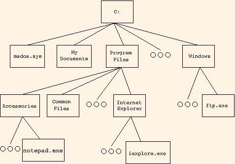

```{r config, include = FALSE}
knitr::opts_chunk$set(error = TRUE)
```

# Questions?


----------

```{r, eval = FALSE}
eight_answer <- function(vector) {
  avg <- mean(vector)
  variance <- var(vector)
  stdev <- sd(vector)
  quant <- quantile(vector)
  print(avg)
  print(variance)
  print (stdev)
  print(quant)
}

eight_answer <- function(vector) {
  avg <- mean(vector)
  variance <- var(vector)
  stdev <- sd(vector)
  quant <- quantile(vector)
  return(list("mean" = avg, "variance" = variance, 
    "stdev" = stdev, quants = quant))
}

```


## Overview

- Review -- File Systems and Navigating
- Notes on Data
- Getting Data Into `R`
- String Manipulation (Homework)


# File System Refresher

## Finding Out Where You Are

- `getwd` 
- `dir`
- `list.files`/`list.dirs`




## Moving to Another Folder

- `setwd()`
- `~`
- `../`


# Types of Data Sources


## Data is Everywhere

- Hand written notes on forms or surveys
- All over the web
    * Web pages & APIs
- Stored in databases
- Stored in structured files
- Comes in many shapes and sizes!
    * (some `R` friendly, some not...)


## Some Notes *Nice* Data

- When starting out, use spreadsheets!
- First row is usually reserved for the *header*
    - Short names are preferred over longer names
    - Try to avoid using names that contain spaces or symbols like `?`, `$`, `%`, `^`, `&`, `*`, `(`, `)`, `-`, `#`, `?`, `,`, `<`, `>`, `/`, `|`, `\`, `[` , `]`, `{`, and `}`
- First column is *sampling unit* (patient, school, dog, etc.)
- Make sure all data is recorded in a way that `R` can interpret
    * I.e. don't use coloring or highlighting to differentiate (use another variable)
- Make sure that any missing values in your data set are indicated with `NA`


# Manually Entering Data

## Typing Data Into `R`


`R` has a simple spreadsheet-style data editor you can use for small data sets. To use it, create an empty data frame, then pass it to the `fix` function:

```{r, eval = FALSE}
mydata <- data.frame (id=0)
fix (mydata)
```

## Typing Data Into `R`

Reminder: Can also define your data in `R` scripts. Build up a bunch of vectors with `c()`; combine to make them a `matrix` or a `data.frame`.

While both of these approaches work, I would advise against using them. 


# Our Data Set


## The Chronic Kidney Disease Data 


[download from UIC](http://archive.ics.uci.edu/ml/datasets/Chronic_Kidney_Disease) or [CourseConnect](https://courses.aquinas.edu/mod/resource/view.php?id=99905)


## A Convoluted Example - ARFF


## `foreign` Package to the Rescue?

- the `foreign` package supports 
- http://www.cs.waikato.ac.nz/~ml/weka/arff.html

```{r}
library(foreign)
arff_dat <- read.arff("data/Chronic_Kidney_Disease/chronic_kidney_disease.arff")
```

## parsing like we're in CS 101 {.smaller}

```{r}
data_lines <- readLines("data/Chronic_Kidney_Disease/chronic_kidney_disease.arff")
column_names <- c()
data_list <- list()
data_time <- FALSE

for (i in seq_along(data_lines)) {
  if (data_lines[i] == "@data") {
    data_time <- TRUE
    next
  }
  if (data_time) {
    data_list <- c(data_list, strsplit(data_lines[i], ','))
  } else {
    if (grepl("^@attribute", data_lines[i])) {
      column_names <- c(
        column_names, 
        gsub("'", '', strsplit(data_lines[i], ' ')[[1]][2])
        )
    }
  }
}

my_df <- do.call(rbind.data.frame, data_list)
names(my_df) <- column_names

```

------------


```{r}
head(my_df)
```


# Text Files


## What Are Delimited Text Files?

- Files that use a character (delimiter) separate each value. 
- Common choices are spaces, tabs, or commas (but you can use anything)
- Rows of data are separated by newlines or carriage returns `\n`, `\r\n` (`ENTER`)
- Demo Time: Exporting these from Excel


## `write.csv`

let's create a CSV file from our data frame we created 

```{r}
write.csv(my_df, "data/created/chronic_kidney_disease.csv")
```

- `quote = TRUE`
- `sep = ","`
- `eol = "\n"`
- `na = "NA"`
- `dec = "."`


## `read.csv`

conveniently, you can read this back in with `read.csv`

```{r}
my_df2 <- read.csv("data/created/chronic_kidney_disease.csv")
```

- `header = TRUE`
- `sep = ","`
- `quote = "\""`
- `dec = "."`


## what changed?

we now have an extra column in `my_df2`?

```{r}
identical(my_df, my_df2)
```

```{r, eval = FALSE}
str(my_df)
str(my_df2)
```

## arguments!

```{r, eval = FALSE}
?write.csv
?read.csv
```

```{r}
write.csv(my_df, "data/created/chronic_kidney_disease.csv", row.names = FALSE)
my_df2 <- read.csv("data/created/chronic_kidney_disease.csv")
identical(my_df, my_df2)
```


## `write.table`

- here we'll create a TXT file from our data frame we created 

```{r}
write.table(my_df, "data/created/chronic_kidney_disease.txt")
```

- `quote = TRUE`
- `sep = " "`
- `eol = "\n"`
- `na = "NA"`
- `dec = "."`


## `read.table`

not surprisingly, you can read this back in with `read.table`

```{r}
my_df3 <- read.table("data/created/chronic_kidney_disease.txt")
```

- `header = FALSE`
- `sep = ""`
- `quote = "\"'"`
- `dec = "."`


## `read.delim`

`read.delim` is a special function for tab-delimited files (i.e. `sep = '\t'`)

```{r}
write.table(my_df, "data/created/chronic_kidney_disease.tsv", sep = "\t")
my_df4 <- read.delim("data/created/chronic_kidney_disease.tsv")
```

- `header = TRUE`
- `sep = "\t"`
- `quote = "\"'"`
- `dec = "."`


## useful `read.*` arguments

- `colClasses` -- zipcode example
- `skip`
- `strip.white`
- `comment.char`

```{r}
my_df5 <- read.csv("data/Chronic_Kidney_Disease/chronic_kidney_disease.arff", 
                    skip = 29, strip.white = TRUE, header = FALSE)
```

A little bit easier :)


## Excel Files

- The old solution was to use the [`xlsx` package](https://cran.r-project.org/web/packages/xlsx/index.html)
    * Powerful solution; very functional if you can get installed
    * Dependent on *java* which can cause some headaches
- New solution, [`openxlsx`](https://cran.r-project.org/web/packages/openxlsx/index.html) to write and [`readxl`](https://cran.r-project.org/web/packages/readxl/index.html)
    * New implementations with no external deps
    * I use these 99% of the time
    * And they're faster!

## Writing Excel Files

```{r}
library(openxlsx)
write.xlsx(my_df, "data/created/chronic_kidney_disease.xlsx", colNames = TRUE)
```


## Reading Excel Files

```{r}
library(readxl)
my_df6 <- read_excel("data/created/chronic_kidney_disease.xlsx")
head(my_df6)
```


# Databases

## `R` Has Support for *Most* Databases

- Can access both local and remote databases
- SQLite, MySQL, PostgreSQL
- MongoDB, Redis, CouchDB
- Google whatever you are using, there is probably an `R` package for it!


## SQLite

```{r, eval = FALSE}
library(RSQLite)
loc <- "/path/to/database"

db <- dbConnect(SQLite(), loc)
dbGetQuery(db, "select something from a_table")
dbDisconnect(db)
```

# Getting Data From the Web


## Web Scraping

See the [`rvest`](https://cran.r-project.org/web/packages/rvest/index.html) & [`XML`](https://cran.r-project.org/web/packages/XML/index.html) packages

```{r}
library("rvest")
htmlpage <- html("http://forecast.weather.gov/MapClick.php?x=146&y=166&site=grr&zmx=&zmy=&map_x=146&map_y=166#.Vgw66hNViko")
forecasthtml <- html_nodes(htmlpage, "#detailed-forecast-body b , .forecast-text")
forecast <- html_text(forecasthtml)
paste(forecast, collapse =" ")
```

## Interacting with APIs

See the [`httr`](https://cran.r-project.org/web/packages/httr/index.html), [`curl`](https://cran.r-project.org/web/packages/curl/index.html), and [`RCurl`](https://cran.r-project.org/web/packages/RCurl/index.html)

[Deck of cards example:](http://deckofcardsapi.com/)

```{r}
library(httr)
res <- GET("http://deckofcardsapi.com/api/deck/new/draw/?count=2")
rawToChar(res$content)
```

## Dealing With JSON Data

Use the [`jsonlite`](https://cran.r-project.org/web/packages/jsonlite/index.html) package! (`fromJSON`/`toJSON`)

```{r, message = FALSE}
library(jsonlite)
prettify(rawToChar(res$content))
```


## Comprehensive Guide for `R` Data Imports 

- [See here](https://cran.r-project.org/doc/manuals/r-release/R-data.html)


# Importing Data with RStudio

