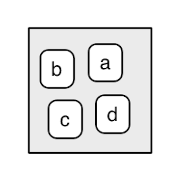

```{r config, include = FALSE}
knitr::opts_chunk$set(error = TRUE)
```

# Questions?


## Overview

- Scripts and execution
- Overview of functions
- Good programming style 


# Scripts and execution

## `R` Scripts

`R` scripts are text files with the file extension `.R`. An example would be something like: `my-script.R`. Scripts will often contain **related** sets of functions and code. 


## Running `R` Scripts from The Console

- You can execute the code within an `R` script by using the `source()` funciton
- You must pass the file location of the script to `source()`
- `R` go line-by-line through the script, executing it as if you were typing in the console
- Method is often used to store user-defined functions in one place
- [Here's an example script to try](https://courses.aquinas.edu/mod/resource/view.php?id=99538)


## Running `R` Scripts from the Command Line

- `R` scripts can also be run from the command line
- The behavior is slightly different depending on your OS

```
Rscript a.R
R CMD BATCH a.R
./a.R # *nix only with appropriate shebang
```

Here's shebang format:

```
#!/usr/bin/env Rscript
sayHello <- function(){
   print('hello')
}
```


# Overview of Functions in `R`

----

A starting thought:


<blockquote>
<br/>
To understand computations in R, two slogans are helpful: <br/><br/>
1) Everything that exists is an object. <br/>
2) Everything that happens is a function call. <br/><br/>
— John Chambers
</blockquote>


## Functions

Functions are created using the function() directive and are stored as `R` objects just like anything else. In particular, they are `R` objects of class “function”.

```{r, eval = FALSE}
f <- function(<arguments>) {
## Do something interesting
}
```

## The anatomy of a function


```{r, eval = FALSE}
function_name <- function(arg1, arg2, ... ){
  R code that does statements stuff with arg1
  and with arg2
  and other stuff
  return(object) # the return value
}
```


## Functions

Functions in `R` are *first class objects*, which means that they can be treated much like any other `R` object. Importantly,

- Functions can be passed as arguments to other functions
- Functions can be nested, so that you can define a function inside of another function

The return value of a function is the last expression in the function body to be evaluated -- or whatever you specify in `return()`.


## Function Arguments

Functions have named arguments which potentially have default values.

- The formal arguments are the arguments included in the function definition
- The `formals` function returns a list of all the formal arguments of a function
- Not every function call in R makes use of all the formal arguments
- Function arguments can be missing or might have default values


## Argument Matching 

`R` functions arguments can be matched **positionally** or **by name**. So the following calls to `sd` are all equivalent

```{r, eval = FALSE}
mydata <- rnorm(100)
sd(mydata)
sd(x = mydata)
sd(x = mydata, na.rm = FALSE)
sd(na.rm = FALSE, x = mydata)
sd(na.rm = FALSE, mydata)
```


## Argument Matching {.smaller}

You can mix positional matching with matching by name. When an argument is matched by name, it is “taken out” of the argument list and the remaining unnamed arguments are matched in the order that they are listed in the function definition.

```{r}
args(lm)
```

The following calls to `lm` are all equivalent:

```{r, eval = FALSE}
lm(formula = y ~ x, data = mydata, subset = 1:100) # naming all arguments
lm(y ~ x, mydata, 1:100) # matching arguments by position
lm(data = mydata, y ~ x, 1:100) # mix of matching and naming
```

## Argument Matching

Function arguments can also be partially matched, which is useful for interactive work.  The order of operations when given an argument is

1. Check for exact match for a named argument
2. Check for a partial match
3. Check for a positional match

These two calls are equivalent:

```{r, eval = FALSE}
plot(1:10, 1:10, main = 'hi') # matching full argument name
plot(1:10, 1:10, ma = 'hi') # matching partial argument name
```


## Lazy Evaluation

Maybe you have wondered why you do not need to fully specify the many arguments listed in the help pages of the functions you have researched in the previous labs and assignments.

Arguments to functions are evaluated lazily, so they are evaluated only as needed.

```{r}
f <- function(a, b) {
  a^2
}
f(2)
```

This function never actually uses the argument `b`, so calling `f(2)` will not produce an error because the 2 gets positionally matched to `a` and `b` is never used within the function body.


## Lazy Evaluation

Another example

```{r}
f <- function(a, b) {
  print(a)
  print(b)
}
f(45)
```

Notice that `45` got printed first before the error was triggered. This is because `b` did not have to be evaluated until after `print(a)`.  Once the function tried to evaluate `print(b)` it had to throw an error.


## The `...`  Argument


The `...` argument indicates a variable number of arguments that are usually passed on to other functions.

`...` is often used when extending another function and you don't want to copy the entire argument list of the original function 
 
```{r, eval = FALSE}
myplot <- function(x, y, type = "l", ...) {
  plot(x, y, type = type, ...)
}
```


## The `...`  Argument

The `...` argument is also necessary when the number of arguments passed to the function cannot be known in advance.


```{r}
args(paste)
```

```{r}
args(cat)
```


## What can a function see and do?

- Each function has its **own environment** -- see deck appendix for details
    - Names here over-ride names in the global environment
    - Internal environment starts with the named arguments
    - Assignments inside the function only change the internal environment
- Names undefined in the function are looked for in the environment the function gets called from (the parent environment)
    - The rules for looking up data associated with a name are referred to as **lexical scoping**


## Lexical Scoping

Scoping is the set of rules that govern how `R` looks up the value of a symbol. In the example below, scoping is the set of rules that `R` applies to go from the symbol x to its value 10:

```{r}
x <- 10
x
```

## The Three Rules of Lexical Scoping

There are three basic principles behind `R`’s implementation of lexical scoping:

- name masking
- a fresh start
- dynamic lookup


## Name Masking

If a name isn’t defined inside a function, R will look one level up.

```{r}
x <- 2
g <- function() {
  y <- 1
  c(x, y)
}
g()
rm(x, g)
```

## Name Masking

The same rules apply if a function is defined inside another function: 

```{r}
x <- 1
h <- function() {
  y <- 2
  i <- function() {
    z <- 3
    c(x, y, z)
  }
  i()
}
h()
rm(x, h)
```


## A fresh start

What happens to the values in between invocations of a function? What will happen the first time you run this function? What will happen the second time? 

```{r}

j <- function() {
  if (!exists("a")) {
    a <- 1
  } else {
    a <- a + 1
  }
  print(a)
}
j()
rm(j)

``` 


## Dynamic Lookup

`R` looks for values when the function is run, not when it’s created. This means that the output of a function can be different depending on objects outside its environment:


```{r}
f <- function() x
x <- 15
f()
```

```{r}
x <- 20
f()
```

You generally want to avoid this behaviour because it means the function is no longer **self-contained**. 

## Functions That Create Functions (Closures)

This function returns another function as its value:

```{r}
make_power <- function(n) {
  pow <- function(x) {
    x^n
  }
  pow
  }
```

```{r}
cube <- make_power(3)
square <- make_power(2)
cube(3)
square(3)
```


# When to use functons

## What should be a function?

- Things you're going to re-run, especially if it will be re-run with changes
- Chunks of code you keep highlighting and hitting return on
- Chunks of code  which are small parts of bigger analyses
- Chunks which are very similar to other chunks


# Programming Style in `R`

## What is Programming Style

- A set of rules for formatting code
- Something that makes code easier to read
    + For yourself and **others**
- Typically agreed upon by the community
    - and further refined within project team
- Kind of a mess in `R`...


## Good Style Guides to Read Through

You should be aware of some "best practices" for `R` style. Try to mirror them as close as possible, but the most important thing for now is that you develop your own style and stick to it. 

- [Hadley's style guide](http://adv-r.had.co.nz/Style.html)
- [Google style guide](http://google-styleguide.googlecode.com/svn/trunk/Rguide.xml)
- *Read the source, Luke...*


#  To the lab...


# Appendix

# An Aside on Environments

## Remember Workspaces?

Previously, we've discussed the idea of a **workspace** when talking about how `R` knows what data are associated with which argument names and when introducing `ls()`

What I didn't tell you is that there can be *many* different "workspaces" in `R` at any given time. To desribe this, we'll breifly introduce the idea of **environments**. 


## What is an Environment?

The job of an environment is to associate, or bind, a set of names to a set of values. You can think of an environment as a bag of names:

<div class="columns-2">




</div>


## What is an Environment?

Some rules about environments:

- Every object in an environment has a unique name
- The objects in an environment are not ordered 
- An environment has a parent


## Creating and Modifying Environments 

```{r}
e <- new.env()
e$a <- FALSE
e$b <- "a"
e$c <- 2.3
e$d <- 1:3
is(e)
ls(e)
```

## Seeing All The Environments


```{r}
search() # lists all parents of the global environment
```


# Ok... what does this have to do with functions?


