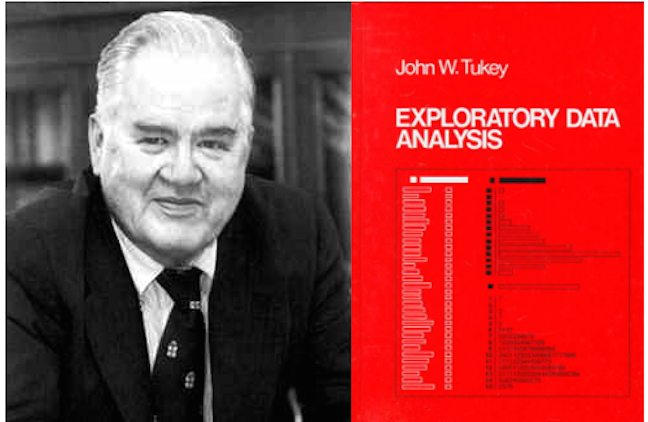
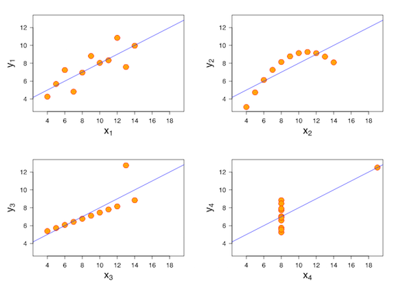
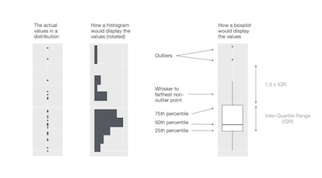
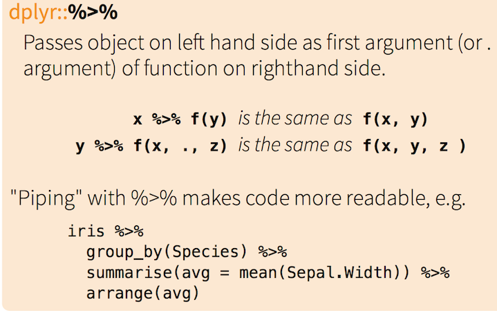
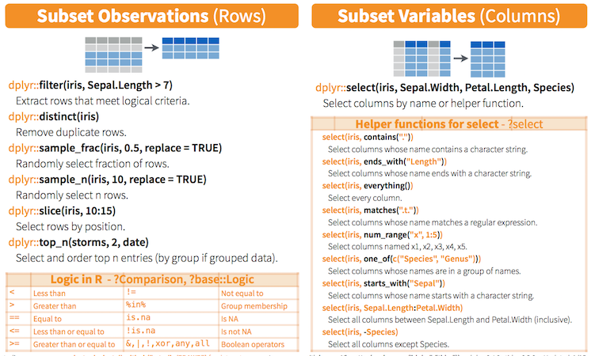
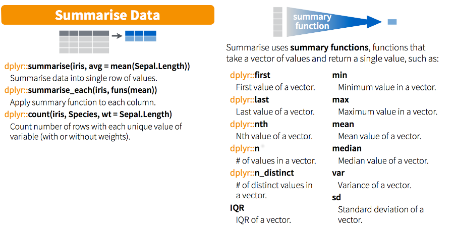
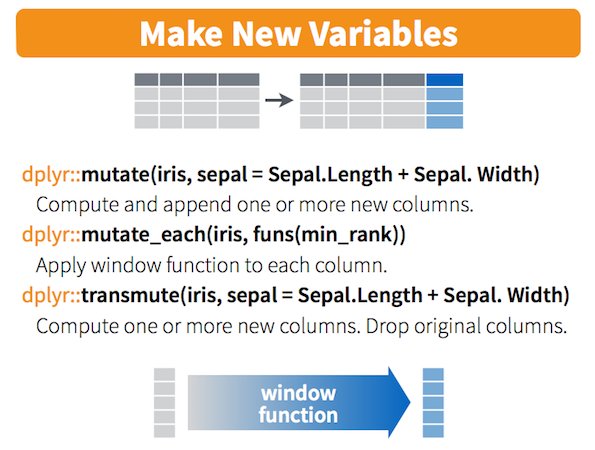
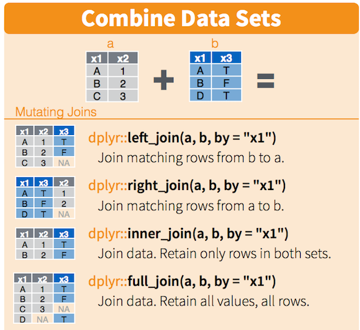

```{r config, include = FALSE}
knitr::opts_chunk$set(error = TRUE, warning = FALSE, fig.align = 'center',
	message = FALSE)
library(ggplot2); library(dplyr);
```

# Questions

## Overview

- What is exploratory data analysis (EDA)?
- Looking at variation and covariation
- Our EDA toolset: `ggplot2` & `dplyr`

# Exploratory Data Analysis


## John Tukey - Father of EDA


> "A picture is not merely worth a thousand words, it is much more likely to be scrutinized than words are to be read."" — John Tukey





## What is Exploratory Data Analysis?

- EDA is a fundamental part of applied statistics
- Typically the first thing you do with your data
- Heavy focus on graphical exploration

> *"EDA is fundamentally a creative process. And like most creative processes, the key to asking quality questions is to generate a large quantity of questions."* - R4DS

## What is it used for?

- Suggesting hypotheses about the causes of observed phenomena
- Identifying outlier data points (e.g. data collection errors/novel findings)
- Assessing assumptions on which statistical inference will be based
- Supporting the selection of appropriate statistical tools and techniques
- Determining relationships among the explanatory variables
- Providing a basis for further data collection through surveys or experiments

<font size="2">[Source](https://en.wikipedia.org/wiki/Exploratory_data_analysis)</font>


# A Famous Example of EDA


## Anscombe's Quartet

A famous case for data visualization: [Anscombe's Quartet](https://en.wikipedia.org/wiki/Anscombe%27s_quartet)




<font size="2">"<a href="https://commons.wikimedia.org/wiki/File:Anscombe%27s_quartet_3.svg#/media/File:Anscombe%27s_quartet_3.svg">Anscombe's quartet 3</a>" by <a href="//commons.wikimedia.org/wiki/File:Anscombe.svg" title="File:Anscombe.svg">Anscombe.svg</a>: <a href="//commons.wikimedia.org/wiki/User:Schutz" title="User:Schutz">Schutz</a>derivative work (label using subscripts): <a href="//commons.wikimedia.org/wiki/User:Avenue" title="User:Avenue">Avenue</a> (<a href="//commons.wikimedia.org/wiki/User_talk:Avenue" title="User talk:Avenue"><span class="signature-talk">talk</span></a>) - <a href="//commons.wikimedia.org/wiki/File:Anscombe.svg" title="File:Anscombe.svg">Anscombe.svg</a>. Licensed under <a href="http://creativecommons.org/licenses/by-sa/3.0" title="Creative Commons Attribution-Share Alike 3.0">CC BY-SA 3.0</a> via <a href="https://commons.wikimedia.org/wiki/">Commons</a>.</font>


# How do we do EDA?

## How do we do it (the full process)?

- Read in data
- Figure out what it is
- Pre-process it
- Look at dimensions
- Look at values (str) 
- Make tables
- **Hunt for messed up values**
- **Hunt for `NA`s**
- **Plot it**


## How do we do EDA? (cont.)

There is no rule about which questions you should ask to guide your research. However, two types of questions will always be useful for making discoveries within your data. You can loosely word these questions as:

1. What type of variation occurs within my variables?
2. What type of covariation occurs between my variables?


## What is variation?

**Variation** is the tendency of the values of a variable to change from measurement to measurement. You can see variation easily in real life; if you measure any continuous variable twice, you will get two different results.

Categorical variables can also vary if you measure across different subjects (e.g. the eye colors of different people), or different times (e.g. the energy levels of an electron at different moments).

Every variable has its own pattern of variation, which can reveal interesting information. The best way to understand that pattern is to visualise the distribution of variable’s values.


## Varition in categorical variables

```{r}
ggplot(data = diamonds) +
  geom_bar(mapping = aes(x = cut))
```

## Variation in continuous variables

```{r}
ggplot(data = diamonds) +
  geom_histogram(mapping = aes(x = carat), binwidth = 0.5)
```

## Variation in continuous variables

```{r}
ggplot(data = faithful, mapping = aes(x = eruptions)) + 
  geom_histogram(binwidth = 0.25)
```

## Variation in continuous variables



## Covariation -- categorical and continuous

```{r}
ggplot(data = mpg, mapping = aes(x = class, y = hwy)) +
  geom_boxplot()
```


## Covariation -- categorical and continuous

```{r}
ggplot(data = mpg) +
  geom_boxplot(mapping = aes(x = reorder(class, hwy, FUN = median), y = hwy))
```

## Covariation -- two continuous variables

```{r}
ggplot(data = diamonds) +
  geom_point(mapping = aes(x = carat, y = price))
```


# Introduction to `dplyr`


## A note on some forthcoming black magic?



<font size="2">[Source](https://www.rstudio.com/wp-content/uploads/2015/02/data-wrangling-cheatsheet.pdf)</font>

## `dplyr` verbs

- `select`: return a subset of the columns of a data frame, using a flexible notation
- `filter`: extract a subset of rows from a data frame based on logical conditions
- `arrange`: reorder rows of a data frame
- `rename`: rename variables in a data frame
- `mutate`: add new variables/columns or transform existing variables
- `summarise` / `summarize`: generate summary statistics of different variables in thedata frame, possibly within strata
- `%>%`: the “pipe” operator is used to connect multiple verb actions together into a pipeline

## The `dplyr` Pattern

- The first argument is a data frame
- The subsequent arguments describe what to do with the data frame
- The result is a new data frame

Learn more by reading the excellent [vignette](https://cran.rstudio.com/web/packages/dplyr/vignettes/introduction.html)


## Subsetting with `select` and `filter`



<font size="2">[Source](https://www.rstudio.com/wp-content/uploads/2015/02/data-wrangling-cheatsheet.pdf)</font>


## `warpbreaks` data

Flash back to Lab/Homework 4:

```{r}
head(warpbreaks)
tapply(warpbreaks$breaks, warpbreaks$wool, sum)
```

## Subsetting with `select` and `filter`

```{r, eval = FALSE}
# all obs with wool == A
filter(warpbreaks, wool == 'A')
warpbreaks %>% filter(wool == 'A')

# just the first two columns
select(warpbreaks, breaks, wool)
warpbreaks %>% select(breaks, wool)

```

Note that we do not need to quote column names when using `dplyr` functions.


## `summarise` & friends



<font size="2">[Source](https://www.rstudio.com/wp-content/uploads/2015/02/data-wrangling-cheatsheet.pdf)</font>


## `summarise` & friends

```{r}
summarize(warpbreaks, 
	mean_breaks = mean(breaks),
	sd_breaks = sd(breaks),
	med_breaks = median(breaks),
	mad_breaks = mad(breaks)
	)

warpbreaks %>% summarise(mean_breaks = mean(breaks), sd_breaks = sd(breaks),
	med_breaks = median(breaks), mad_breaks = mad(breaks))
```

## `mutate` & friends



<font size="2">[Source](https://www.rstudio.com/wp-content/uploads/2015/02/data-wrangling-cheatsheet.pdf)</font>


## `mutate` & friends

```{r}
w2 <- warpbreaks %>% 
	mutate(combo = paste(wool, tension, sep = '_'))
head(w2)
```


## `group_by` and chaining

```{r}
# base R way -- not tidy
tapply(warpbreaks$breaks, warpbreaks$wool, sum)

# tidy with dplyr
warpbreaks %>% 
	group_by(wool) %>% 
	summarize(total_breaks = sum(breaks)) 
```


## `group_by` and chaining

```{r}
# base R way -- not tidy
tapply(warpbreaks$breaks, warpbreaks$tension, mean)

# tidy with dplyr
warpbreaks %>% 
	group_by(tension) %>% 
	summarize(mean_breaks = mean(breaks)) 
```

## combining data sets with `dplyr`



<font size="2">[Source](https://www.rstudio.com/wp-content/uploads/2015/02/data-wrangling-cheatsheet.pdf)</font>

----------

```{r}
df1 <- data.frame(X = letters[1:4], y1 = 1:4, stringsAsFactors = FALSE)
df2 <- data.frame(X = letters[3:6], y2 = 3:6, stringsAsFactors = FALSE)
left_join(df1, df2, by = 'X')
right_join(df1, df2, by = 'X')
```
----------

```{r}
inner_join(df1, df2, by = 'X')
full_join(df1, df2, by = 'X')
```


## Further Reading

- [Exploratory Data Analysis with R](https://leanpub.com/exdata)


