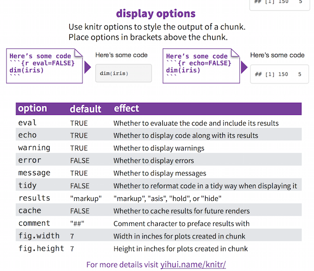

```{r config, include = FALSE}
knitr::opts_chunk$set(error = TRUE, warning = FALSE, fig.align = 'center', message = FALSE)
```

# Questions

## Overview

- Reproducibility & why it's important
- `rmarkdown` and `knitr`


# Reproducibility


## Reproducibility & Replicability

**Reproducibility** -- the ability to recompute results -- and **replicability** -- the chances other experimenters will achieve a consistent result -- are two foundational characteristics of successful scientific research. 

<font size="2">[Source](http://www.ncbi.nlm.nih.gov/pmc/articles/PMC4330755/)</font>


## Why is it important?


## Analytical Workflow


<font size="2">[Source](http://rpubs.com/mansun_kuo/24330)</font>


## Reproducibility IRL

<div class="columns-2">


**The Sad Analyst's Infinite Loop:**

1. Data preparation
2. Modeling
3. Generating report
4. Something wrong in your data
5. Repeat 1 ~ 4  


</div>

## Traditional Approach


<font size="2">[Source](https://stat.duke.edu/~mc301/posters/user2014_reproduce_poster.pdf)</font>


## Better Approach 


<font size="2">[Source](https://stat.duke.edu/~mc301/posters/user2014_reproduce_poster.pdf)</font>


## R Markdown -- Our Better Approach


# `rmarkdown` and `knitr`


## Installing

Run the following to install the necessary packages:

```{r, eval = FALSE}
install.packages(c('rmarkdown', 'knitr'))
```

## R Markdown -- Our Better Approach


*Looks a lot like:*


## What is Markdown?


## What is Markdown?

> Markdown is a lightweight markup language, originally created by John Gruber and Aaron Swartz allowing people "to write using an easy-to-read, easy-to-write plain text format, then convert it to structurally valid XHTML (or HTML)".


## What is Markdown?


## Markdown Preview Tools

- [Web](http://markdownlivepreview.com/)
- [Windows/OS X/Linux](http://pad.haroopress.com/)
- [My preferred OS X tool](http://25.io/mou/)


## Markdown Quick Reference in RStudio


# Markdown Basics


## Emphasis

```
*italic*   **bold**
_italic_   __bold__
```

*italic*  
**bold**


## Headers

```
# Header 1

## Header 2

### Header 3
```

## Manual Line Breaks

End a line with two or more spaces:

```
Roses are red,  
Violets are blue.
```

## Lists

<div class="columns-2">

```
Unordered List:

* Item 1
* Item 2
    + Item 2a
    - Item 2b

Ordered List:

1. Item 1
2. Item 2
3. Item 3
    + Item 3a
    + Item 3b
```

Unordered List:

* Item 1
* Item 2
    + Item 2a
    - Item 2b

Ordered List:

1. Item 1
2. Item 2
3. Item 3
    + Item 3a
    + Item 3b


</div>


## Links

Inline Link:

```
I hope you aren't browsing [reddit](reddit.com)
```

I hope you aren't browsing [reddit](reddit.com)

Reference Link:


```
I hope you aren't browsing [reddit](r)

[r]: reddit.com
```

I hope you aren't browsing [reddit](r)

[r]: reddit.com


## Images

<div class="columns-2">

Inline Image:

```

```

Reference Image:

```


[ref]: ../images/betr-appr2.png
```


</div>


## Blockquotes

Blockquotes let you use the `<blockquote>` tag to let readers know you are quoting someone:

```
> Statistical thinking will one day be as necessary a qualification for efficient
> citizenship as the ability to read and write. --H.G. Wells
```

> Statistical thinking will one day be as necessary a qualification for efficient citizenship as the ability to read and write. --H.G. Wells


## Plain Code Blocks

Plain code blocks are displayed in a fixed-width font but not evaulated.

```
 ```
This text is displayed verbatim / preformatted  
Useful if you want to inlcude code from other languages  
Or just want rigid formatting
 ```
```


## Embedding Equations

LaTeX
Inline equation: `$equation$`

Display equation: `$$ equation $$`

```
$$ 
	\large{ \sigma^2 = \frac { \sum_{i=1}^{n} \left( x_i - \bar{x} \right) ^ 2} {n-1} }
$$
```


$$ \large{ \sigma^2 = \frac { \sum_{i=1}^{n} \left( x_i - \bar{x} \right) ^ 2} {n-1} }$$


## Horizontal Rules

You can use either of the following to insert a horizontal rule (`<hr>` tag) in your document to split up different sections. 

`---------`  


`*********`

## Tables

<div class="columns-2">

First Header  | Second Header
------------- | -------------
Content Cell  | Content Cell
Content Cell  | Content Cell


```
First Header  | Second Header
------------- | -------------
Content Cell  | Content Cell
Content Cell  | Content Cell
```

</div>


# Integrating `R` Code

## R Code Chunks


## Output Options




## Tables (A more useful example...)

```{r}
library(knitr) # install if necessary
my_table <- data.frame(Col1 = letters[1:3], Col2 = 1:3)
kable(my_table)
```


# Anatomy of an R Markdown Document


## Our Example Document


## YAML Metadata: YAML document options

<div class="columns-2">


- Title and author info
- Defines document output format
    + we will focus on HTML
    + can be multiple
- Specifies additional output options
- Can include links to CSS files here


</div>


## Markdown: Article text

<div class="columns-2">


- Markdown is used for the text of your document
- Use any of the syntax shown in class
- Complete reference [here](https://www.rstudio.com/wp-content/uploads/2015/03/rmarkdown-reference.pdf)


</div>


## R Code Chunk: Executible R code

<div class="columns-2">


- Any `R` code is allowed
- Will be executed sequentially to generate output
- Create graphs, numerical output, tables


</div>


## Creating an R Markdown Document in RStudio


## Compiling an R Markdown Document


## R Markdown Live Preview (Experimental)

Install `editR` from [here](https://github.com/swarm-lab/editR)


## Sharing Your Work

- Send an HTML file to collaborator
- Host it on GitHub for free (see [here](https://pages.github.com/) and [here](http://kbroman.org/simple_site/))
- Use a [free Amazon EC 2 server](https://aws.amazon.com/free/)
- Use the free RStudio services:


## `rmarkdown` resources

- http://shiny.rstudio.com/articles/rmarkdown.html


## Lab/Homework

Please read the following:

- http://kbroman.org/knitr_knutshell/pages/Rmarkdown.html
- http://kbroman.org/knitr_knutshell/pages/figs_tables.html

Additionally, select one of your previous assignments (perhaps one you didn't do great on) and re-do it using `knitr` and `rmarkdown`.


