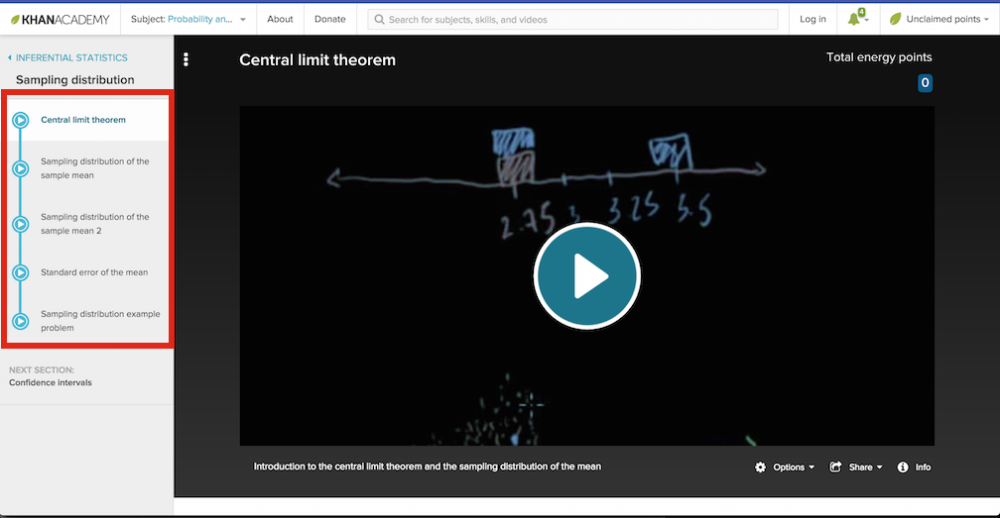

```{r config, include=FALSE}
knitr::opts_chunk$set(warning = FALSE, fig.align = 'center', 
                      verbose = TRUE, message = FALSE)

```

# Directions

Please work through the material below. You do not have to submit anything to CourseConnect this week; however, please be sure you work through and understand the material below as the concepts here will serve as the foundation for the ideas we will cover in the remaining weeks of class. 


****************


# Additional Lectures

The next few sections contain online lectures that will provide additional context to the material covered in class. Feel free to skip a set of videos if you have covered the material in a different class or if the concept was clear from the lecture. You won't be tested on the formal mathematics of these ideas, but it is important to conceptually grasp why these methods work. 

### Random Variables

[Here's](https://www.khanacademy.org/math/statistics-probability/random-variables-stats-library/discrete-and-continuous-random-variables/v/random-variables) a set of Khan Academy videos that discuss random variables -- what they are, what properties they have, and what they can be used for. 

## Sampling Distributions & the CLT

To further your understanding of the sampling distributions and the CLT, please watch [these](https://www.khanacademy.org/math/probability/statistics-inferential/sampling_distribution/v/central-limit-theorem) videos from Khan Academy. There are five total videos (highlighted below). These should help provide additional understanding of these critical concepts. The creator beats some of the issues to death, so feel free to skip ahead if you start to get bored (or watch on 1.5X speed). 




### Hypothesis testing

[Here's](https://www.khanacademy.org/math/statistics-probability/significance-tests-one-sample/idea-of-significance-tests/v/simple-hypothesis-testing) a set of four Khan Academy videos that discuss the ideas behind hypothesis testing. 


### P-values

You've learned about p-values in previous classes. Watch these videos to refresh your memory on what a p-value is and what information it tells you. 

- [Good review of p-values](https://www.youtube.com/watch?v=UsU-O2Z1rAs)
- [The dance of the p-values](https://www.youtube.com/watch?v=5OL1RqHrZQ8)


****************


# `swirl` tutorials


## Installing the `Statistical Inference` module

We will be using a different `swirl` course than we used during our previous lessons. We'll need to use the `install_course` course function to install the `Statistical Inference` from the `swirl` course repository:

```{r, eval=FALSE}
library(swirl)
install_course("Statistical Inference")
```


## Starting the `Statistical Inference` module

You can begin your `swirl` session by typing `swirl` at the command prompt:

```{r, eval = FALSE}
swirl()
```

`swirl` might ask you a few questions on startup. Once you work through those, you should be presented with a menu that prompts you to choose a course. Please select the menu item corresponding to the `Statistical Inference` course (menu option 2 in the example output below):

```
| Please choose a course, or type 0 to exit swirl.

1: R Programming
2: Statistical Inference
3: Take me to the swirl course repository!

Selection: 
```

You will be shown a list of lessons you can work through after choosing the `Statistical Inference` course. Please work through `2: Probability1`, `3: Probability2`, `10: Hypothesis Testing`, and `11: P Values`.


```
| Please choose a lesson, or type 0 to return to course menu.

 1: Introduction             2: Probability1             3: Probability2          
 4: ConditionalProbability   5: Expectations             6: Variance              
 7: CommonDistros            8: Asymptotics              9: T Confidence Intervals
10: Hypothesis Testing      11: P Values                12: Power                 
13: Multiple Testing        14: Resampling              
```


**********************

# Probability Review

[Here's](https://www.khanacademy.org/math/probability/probability-geometry/probability-basics/v/basic-probability) a good set of Khan Academy videos reviewing basic probability theory. If you have not had a course in basic probability (or it has been a long time since you covered these materials) please review these videos. 


