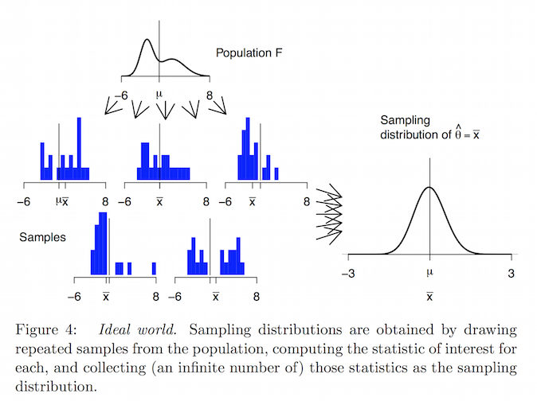
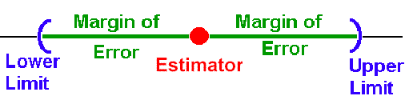
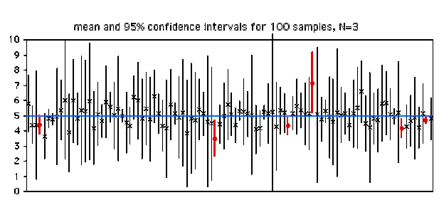
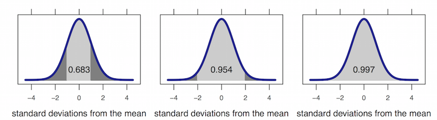

```{r config, include=FALSE}
library(grid)
library(png)
library(ggplot2)
```


# Questions


## Overview

- statistical inference
- probability
- sampling distributions
- famous statistical concepts

# Statistical Inference


## What is statistical inference?

**Statistical inference** is the process of drawing formal conclusions from data. 

In our class, we wil define formal statistical inference as settings where one wants to **infer facts about a population using noisy statistical data where uncertainty must be accounted for**.


## Motivating example: who's going to win the election?

In every major election, pollsters would like to know, ahead of the actual election, who's going to win. Here, the target of estimation (the estimand) is clear, the percentage of people in a particular group (city, state, county, country or other electoral grouping) who will vote for each candidate.

We can not poll everyone. Even if we could, some polled may change their vote by the time the election occurs. How do we collect a reasonable subset of data and quantify the uncertainty in the process to produce a good guess at who will win?


## Motivating example: is hormone replacement therapy effective?

A large clinical trial (the Women’s Health Initiative) published results in 2002 that contradicted prior evidence on the efficacy of hormone replacement therapy for post menopausal women and suggested a negative impact of HRT for several key health outcomes. Based on a statistically based protocol, the study was stopped early due an excess number of negative events.

Here's there's two inferential problems.

- Is HRT effective?
- How long should we continue the trial in the presence of contrary evidence?


## Why do we do statistical inference?

1. Estimate and quantify the uncertainty of an estimate of 
a population quantity (the proportion of people who will
  vote for a candidate).
2. Determine whether a population quantity 
  is a benchmark value ("is the treatment effective?").
3. Infer a mechanistic relationship when quantities are measured with
  noise ("What is the slope for Hooke's law?")
4. Determine the impact of a policy? ("If we reduce polution levels,
  will asthma rates decline?")


# Probability

## Probability

* **Probability** = the study of quantifying the likelihood of particular events occurring
* Given a random experiment, the ***probability*** is population quantity that summarizes the randomness
* Not in the data at hand, but a conceptual quantity that exist in the population that we want to estimate
	    

## Random Variables 

* **Random variable** = numeric outcome of experiment
	* Can take on a set of possible different values each with an associated probability
* Two main types:
	* **discrete** (what you can count/categories) = assign probabilities to every number/value the variable can take
		* coin flip, rolling a die, web traffic in a day
	* **continuous** (any number within a continuum) = assign probabilities to the range the variable can take
		* BMI index, intelligence quotients
- `rbinom()`, `rnorm()`, `rgamma()`, `rpois()`, `runif()`: `R` functions to generate random variables from the binomial, normal, Gamma, Poisson, and uniform distributions

## Random Variables 

```{r, fig.height = 4, fig.width = 6, fig.align = 'center'}
hist(rnorm(10000), breaks = 100, col = 'grey')
```

## Probability Mass Function (PMF)  {.smaller}

* Evaluates the probability that the **discrete random variable** takes on a **specific value**
	- I.e. it measures the chance of a particular outcome happening
	* Always $\ge$ 0 for every possible outcome
	* $\sum$(possible values that the variable can take) = 1
* ***Bernoulli distribution example***
	* X = 0 $\rightarrow$ tails, X = 1 $\rightarrow$ heads
        * X here represents potential outcome
	* $P(X = x) = (\frac{1}{2})^x(\frac{1}{2})^{1-x}$ for $X = 0, 1$
        * $x$ here represents a value we can plug into the PMF
		* general form $\rightarrow$ $p(x) = (\theta)^x(1-\theta)^{1-x}$


## Probability Mass Function (PMF)

* `dbinom(k, n, p)` = return the probability of getting `k` successes out of `n` trials, given probability of success is `p`

```{r, fig.height = 4, fig.width = 6, fig.align = 'center'}
plot(dbinom(1:10, 10, .5), type = 'h', lwd = 3)
```

## PMF for continuous random variable???

* The PMF does not make sense for continuous variables
* The probability of the variable taking a specific value = 0 (area of a line is 0)

```{r echo = FALSE, fig.width = 3, fig.height = 3, fig.align = 'center'}
grid.raster(readPNG("../images/4-2.png"))
```

## Probability Density Function (PDF) {.smaller}

* Evaluates the probability that the **continuous random variable** takes on a specific value 
	* always $\ge$ 0 everywhere
	* total area under curve must = 1
* **Areas under PDFs** correspond to the probabilities for that random variable taking on that range of values (PMF)

```{r echo = FALSE, fig.width = 2, fig.height = 2, fig.align = 'center'}
grid.raster(readPNG("../images/4-1.png"))
```

* `dnorm()`, `dgamma()`, `dpois()`, `dunif()` = return probability of a certain value from the normal, Gamma, Poisson, and uniform distributions

## Cumulative Distribution Function (CDF)

* CDF of a random variable $X$ = probability that the random variable is $\le$ value $x$
	* $F(x) = P(X \le x)$ = applies when $X$ is discrete/continuous
* PDF = derivative of CDF
	* integrate PDF $\rightarrow$ CDF
		* `integrate(function, lower=0, upper=1)` $\rightarrow$ can be used to evaluate integrals for a specified range
* `pbinom()`, `pnorm()`, `pgamma()`, `ppois()`, `punif()` = returns the cumulative probabilities from 0 up to a specified value from the binomial, normal, Gamma, Poisson, and uniform distributions

## PDF vs. CDF

```{r}
par(mfrow=c(1,2))
plot(dnorm(seq(-3, 3, .05)), pch = 16, main = 'PDF')
plot(pnorm(seq(-3, 3, .05)), pch = 16, main = 'CDF')
par(mfrow=c(1,1))
```


# Sampling Distributions

## What is a sampling distribution

If we could repeatedly sample from a *population*, and if we computed a *statistic* from each *sample*, the distribution of those statistics would be the **sampling distribution**. Sampling distributions tell us how things vary from sample to sample and are the key to interpreting data.

1. Draw samples from the population.
2. Compute the statistic of interest for each sample (such as the mean, median, etc.)
3. The distribution of the statistics is the sampling distribution.


## Sampling Distribution



<font size="2">[Source](http://arxiv.org/abs/1411.5279)</font>

## Sampling Distribution - Importance

Much of inferential statistics requires estimating something about the sampling distribution.

*Take MS 494 if you want to learn all the math :)*


## Standard Error

The standard deviation of a *sampling distribution* is called the **standard error**, often denoted *SE*.

The **standard error** is our primary way of measuring how much variability there is from sample statistic to sample statistic, and therefore how precise our estimates are.


## Interval Estimates

An **interval estimate** gives a range of plausible values for a population parameter.

This is better than a single number (also called a point estimate) because it gives some indication of the precision of the estimate.

## Margin of Error

One way to express an *interval estimate* is with a point estimate and a **margin of error**.




## Confidence Interval

A **confidence interval** for a parameter is an interval computed from sample data by a method that will capture the parameter for a specified proportion of all samples:

- The probability of correctly containing the parameter is called the coverage rate or confidence level.
- 95% of 95% confidence intervals contain the parameter being estimated.




## Confidence Interval 

- There are exact mathematical formulae for constructing confidence intervals for many statistics
	+ We'll review deriving the the confidence interval of a mean [here](http://dsearls.org/courses/M120Concepts/ClassNotes/Statistics/530G_Derivation.htm)
- But this is not a theoretical math class, so you won't have to do that again
- We'll discuss a different approach for deriving confidence intervals


## Sampling Distribution Characteristics

In many (but not all) situations, the sampling distribution is

- unimodal,
- symmetric, and 
- bell-shaped

*Do we know any distributions like that?*


## Normal Distributions

Normal Distributions: 

- are symmetric, unimodal, and bell-shaped
- can have any combination of mean and standard deviation (as long as the standard deviation is positive)
- satisfy the 68–95–99.7 rule:




## Z-scores

Because probabilities in a normal distribution depend only on the number of standard deviations above and below the mean, it is useful to define Z-scores (also called standardized scores) as follows:

$$ 
	Z-score = \frac{value − mean}{standard~deviation} 
$$

If we know the population mean and standard deviation, we can plug those in. When we do not, we will use the mean and standard deviation of a random sample as an estimate. Z-scores provide a second way to compute normal probabilities. 


## Approximating Confidence Intervals

So sampling distributions can often be thought of as *approximately normal*. In these situations, a 95% confidence interval can be estimated with

$$
	statistic ± 2SE
$$


# Famous Statistical Concepts

## Asymptotics

* **asymptotics** = behavior of statistics as sample size $\rightarrow$ $\infty$
* useful for simple statistical inference/approximations
* form basis for frequentist interpretation of probabilities ("Law of Large Numbers")

## Law of Large Numbers (LLN) {.smaller}

* IID sample statistic that estimates property of the sample (i.e. mean, variance) ***becomes*** the population statistic (i.e. population mean, population variance) as $n$ increases
* ***Note**: an estimator is **consistent** if it converges to what it is estimating *
* sample mean/variance/standard deviation are all ***consistent estimators*** for their population counterparts
	- $\bar X_n$ is average of the result of $n$ coin flips (i.e. the sample proportion of heads)
	- as we flip a fair coin over and over, it ***eventually converges*** to the true probability of a head

## Example - LLN for Normal and Bernoulli Distribution {.smaller}

* Here we simulate 10000 samples from the normal and Bernoulli distributions respectively
* we will plot the distribution of sample means as $n$ increases and compare it to the population means
* as we can see from above, for both distributions the sample means undeniably approach the respective population means as $n$ increases


```{r fig.width = 6, fig.height = 3, fig.align = 'center', message = F, warning = F, echo = F}
# load library
library(gridExtra)
# specify number of trials
n <- 10000
# calculate sample (from normal distribution) means for different size of n
means <- cumsum(rnorm(n)) / (1  : n)
# plot sample size vs sample mean
g <- ggplot(data.frame(x = 1 : n, y = means), aes(x = x, y = y))
g <- g + geom_hline(yintercept = 0) + geom_line(size = 2)
g <- g + labs(x = "Number of obs", y = "Cumulative mean")
g <- g + ggtitle("Normal Distribution")
# calculate sample (coin flips) means for different size of n
means <- cumsum(sample(0 : 1, n , replace = TRUE)) / (1  : n)
# plot sample size vs sample mean
p <- ggplot(data.frame(x = 1 : n, y = means), aes(x = x, y = y))
p <- p + geom_hline(yintercept = 0.5) + geom_line(size = 2)
p <- p + labs(x = "Number of obs", y = "Cumulative mean")
p <- p + ggtitle("Bernoulli Distribution (Coin Flip)")
# combine plots
grid.arrange(g, p, ncol = 2)
```


## Central Limit Theorem {.smaller}

* one of the most important theorems in statistics
* distribution of means of IID variables approaches the standard normal as sample size $n$ increases
* in other words, for large values of $n$, $$\frac{\mbox{Estimate} - \mbox{Mean of Estimate}}{\mbox{Std. Err. of Estimate}} = \frac{\bar X_n - \mu}{\sigma / \sqrt{n}}=\frac{\sqrt n (\bar X_n - \mu)}{\sigma} \longrightarrow N(0, 1)$$
* this translates to the distribution of the sample mean $\bar X_n$ is approximately $N(\mu, \sigma^2/n)$
	- distribution is centered at the population mean
	- with standard deviation = standard error of the mean
* typically the Central Limit Theorem can be applied when $n \geq 30$

## Example - CLT with Bernoulli Trials (Coin Flips) {.smaller}

- for this example, we will simulate $n$ flips of a possibly unfair coin
	- let $X_i$ be the 0 or 1 result of the $i^{th}$ flip of a possibly unfair coin
	+ sample proportion , $\hat p$, is the average of the coin flips
	+ $E[X_i] = p$ and $Var(X_i) = p(1-p)$
	+ standard error of the mean is $SE = \sqrt{p(1-p)/n}$
+ in principle, standardizing the random variable $X_i$, we should get an approximately standard normal distribution $$\frac{\hat p - p}{\sqrt{p(1-p)/n}} \sim N(0,~1)$$

## Example - CLT with Bernoulli Trials (Coin Flips)

- Here we flip a coin $n$ times, take the sample proportion of heads (successes with probability $p$), subtract off 0.5 (ideal sample proportion) and multiply the result by $\frac{1}{2 \sqrt{n}}$ and compare it to the standard normal

```{r, echo = FALSE, fig.width=6, fig.height = 3, fig.align='center', echo = F}
# specify number of simulations
nosim <- 1000
# convert to standard normal
cfunc <- function(x, n) 2 * sqrt(n) * (mean(x) - 0.5)
# simulate data for sample sizes 10, 20, and 30
dat <- data.frame(
	x = c(apply(matrix(sample(0:1, nosim*10, replace=TRUE), nosim), 1, cfunc, 10),
        apply(matrix(sample(0:1, nosim*20, replace=TRUE), nosim), 1, cfunc, 20),
        apply(matrix(sample(0:1, nosim*30, replace=TRUE), nosim), 1, cfunc, 30)),
	size = factor(rep(c(10, 20, 30), rep(nosim, 3))))
# plot histograms for the trials
g <- ggplot(dat, aes(x = x, fill = size)) + geom_histogram(binwidth=.3,
	colour = "black", aes(y = ..density..))
# plot standard normal distribution for reference
g <- g + stat_function(fun = dnorm, size = 2)
# plot panel plots by sample size
g + facet_grid(. ~ size)
```

## Example - CLT with Bernoulli Trials (Coin Flips) {.smaller}

* now, we can run the same simulation trials for an extremely unfair coin with $p$ = 0.9

```{r, echo = FALSE, fig.width=6, fig.height = 3, fig.align='center', echo = F}
# specify number of simulations
nosim <- 1000
# convert to standard normal
cfunc <- function(x, n) sqrt(n) * (mean(x) - 0.9) / sqrt(.1 * .9)
# simulate data for sample sizes 10, 20, and 30
dat <- data.frame(
	x = c(apply(matrix(sample(0:1, prob = c(.1,.9), nosim * 10, replace = TRUE),
                     nosim), 1, cfunc, 10),
        apply(matrix(sample(0:1, prob = c(.1,.9), nosim * 20, replace = TRUE),
                     nosim), 1, cfunc, 20),
        apply(matrix(sample(0:1, prob = c(.1,.9), nosim * 30, replace = TRUE),
                     nosim), 1, cfunc, 30)),
	size = factor(rep(c(10, 20, 30), rep(nosim, 3))))
# plot histograms for the trials
g <- ggplot(dat, aes(x = x, fill = size)) + geom_histogram(binwidth=.3,
	colour = "black", aes(y = ..density..))
# plot standard normal distribution for reference
g <- g + stat_function(fun = dnorm, size = 2)
# plot panel plots by sample size
g + facet_grid(. ~ size)
```

## CLT Takeaways

* The converted/standardized distribution of the samples convert to the standard normal distribution
* ***Note**: speed at which the normalized coin flips converge to normal distribution depends on how biased the coin is (value of $p$) *
* ***Note**: does not guarantee that the normal distribution will be a good approximation, but just that eventually it will be a good approximation as n $\rightarrow \infty$ *


